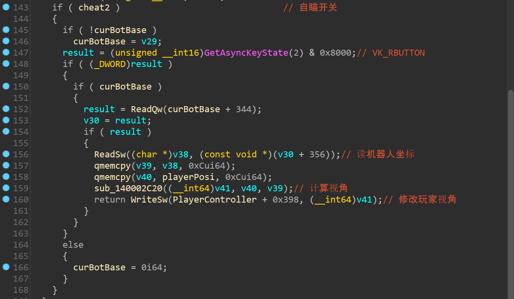

<div>
<center>
<h3>
UE4外挂实现分析-PC端
<h3>
  </center>
</div>

### 游戏分析

> 分析工具：
> 
> [Cheat Engine 7.5](https://github.com/cheat-engine/cheat-engine)
> 
> [x64dbg](https://github.com/x64dbg/x64dbg)
> 
> [IDA Pro](https://hex-rays.com/IDA-pro/)

> 参考文章：
> 
> [UE4逆向笔记之GWORLD GName GameInstance - 小透明‘s Blog](http://www.pentester.top/index.php/archives/117/)

本次分析的游戏使用UE4.22引擎开发，外挂实现功能有透视和自瞄，两项功能都基于游戏内玩家对象和敌人对象的坐标位置实现。UE4游戏内对象的结构如下图所示


> 图片中的对象偏移与UE引擎版本相关，存在误差。

根据上图的关系，游戏中所有的对象都挂在`UWorld`下面，通过`UWorld->GameInstance->ULocalPlayer->LocalPlayer->PlayerController->Actor`可以获取到游戏玩家的Actor对象，进而获取玩家的坐标等信息

通过`PWorld->ULevel->ActorCount`和`PWorld->ULevel->ActorArray`可以遍历游戏中所有的Actor对象，包括敌人的Actor对象，进而获取敌人坐标信息，在一局游戏中，`PWorld`指针与`UWorld`相同

#### CE分析UWorld

开启游戏使用CE打开游戏进程

寻找游戏内能直接获取的与玩家信息有关的详细数据，游戏中子弹数量能够直接查看到准确数值，并且方便控制，因此使用CE查找子弹数量的地址

首先搜索准确的32位整数50


开枪减少子弹数量，继续搜索48


只剩两个地址，修改这两个地址处的值，查看游戏内子弹数量是否发生变化，


可以确定子弹数量储存在`0x1E3EDF40684`地址处，对该地址进行指针分析


根据`GameInstance`到`PlayerController`的偏移关系`0x38 -> 0x0 -> 0x30`过虑到如下指针链


其中存在条指针链

```c
"ShooterClient.exe"+02F6E6E8->0xD80->0x38->0x0->0x30->0x3B0->0x778->0x584
"ShooterClient.exe"+02F71060->0x160->0x38->0x0->0x30->0x3B0->0x778->0x584
```

因此可以分析出`UWorld`为`ShooterClient.exe+02F6E6E8`或`ShooterClient.exe+02F71060`

```c
UWorld = [ShooterClient.exe+0x02F71060]
GameInstance = [UWorld+0x160]
ULocalPlayer = [GameInstance+0x38]
LocalPlayer=[ULocalPlayer]
PlayerController = [LocalPlayer+0x30]
PlayerActor = [PlayerController+03B0]ReadProcessMemory(hProcess, (LPVOID)((BYTE*)baseAddr + 0x2E6E0C0), (LPVOID)&GName, 8, NULL);
```

继续使用浮点数模糊搜索玩家坐标、视角信息等，由于已经确定玩家子弹数量地址，因此可以缩小搜索范围在`0x1E3EDF40684`附近

得到如下指针信息

```c
bullet = [[PlayerActor+0x778]+0x584]
posi_x = [[PlayerActor+0x3A0]+0x1A0]
posi_y = [[PlayerActor+0x3A0]+0x1A4]
posi_z = [[PlayerActor+0x3A0]+0x1A8]
persp_x = [[PlayerActor+0x3A0]+0x154]
persp_y = [[PlayerActor+0x3A0]+0x174]
```

基于上述信息，还能确定`ULevel`

```c
ULevel = [UWorld+0x30]
```

`ActorCount`和`ActorArray`的偏移可以使用CE的结构体分析功能


经过分析，确定`ActorCount`和`ActorArray`的偏移

```c
ActorCount = [ULevel+0xA0]
ActorArray = [ULevel+0x98]
```

遍历`ActorArray`可以获得游戏内所有的Actor对象，包含了敌人对象，但还需要识别是否为敌人，所以还需要查找对象的Name

#### CE分析GName

UE4.23以下版本使用的GName算法如下

```c
BYTE *GetName(int id)
{
    int idx0 = id / 0x4000;
    int idx1 = id % 0x4000;
    BYTE *NameArray = [GName + idx0 * 8];
    BYTE *Name = [NameArray + idx1 * 8] + 0xC;
    return Name;
}
```

使用CE搜索进程内存，查找关键字符串`ByteProperty`


如果上一个字符串为`None`，则表示搜索到了正确位置，此处为游戏对象的Name表

由于`ByteProperty`字符串id为1,可以根据`GetName`算法逆推GName

搜索地址`0x1E3D5EA0024-0xC`


搜索`0x1E3D5E80008-1*8`


搜索`0x1E3D5E70080`


可以确定GName为`ShooterClient.exe+2D310B0`或`ShooterClient.exe+2E6E0C0`

编写代码验证上述分析的偏移

```c
int main()
{
    LPCWSTR procName = L"ShooterClient.exe";
    DWORD dwPID;
    HANDLE hProcess;
    LPVOID baseAddr;
    dwPID = getDwPidByName(procName);
    printf("PID: %d\n", dwPID);
    hProcess = OpenProcess(PROCESS_ALL_ACCESS, FALSE, dwPID);
    if (hProcess == NULL)
    {
        printf("open process failed\n");
        return 0;
    }
    baseAddr = getModuleBase(dwPID);
    printf("proc base: 0x%llx\n", baseAddr);

    LPVOID UWorld;
    LPVOID GName;
    LPVOID GameInstance;
    LPVOID ULocalPlayer;
    LPVOID LocalPlayer;
    LPVOID PlayerController;
    LPVOID PlayerActor;
    LPVOID PlayerPosition;
    LPVOID ULevel;
    DWORD ActorCount;
    LPVOID ActorArray;
    // 读取UWorld
    ReadProcessMemory(hProcess, (LPVOID)((BYTE*)baseAddr + 0x02F71060), (LPVOID)&UWorld, 8, NULL);
    ReadProcessMemory(hProcess, (LPVOID)((BYTE*)UWorld + 0x160), (LPVOID)&GameInstance, 8, NULL);
    ReadProcessMemory(hProcess, (LPVOID)((BYTE*)GameInstance + 0x38), (LPVOID)&ULocalPlayer, 8, NULL);
    ReadProcessMemory(hProcess, (LPVOID)ULocalPlayer, (LPVOID)&LocalPlayer, 8, NULL);
    ReadProcessMemory(hProcess, (LPVOID)((BYTE*)LocalPlayer + 0x30), (LPVOID)&PlayerController, 8, NULL);
    ReadProcessMemory(hProcess, (LPVOID)((BYTE*)PlayerController + 0x3B0), (LPVOID)&PlayerActor, 8, NULL);
    printf("\n");
    printf("UWorld: 0x%llx\n", UWorld);
    printf("GameInstance: 0x%llx\n", GameInstance);
    printf("ULocalPlayer: 0x%llx\n", ULocalPlayer);
    printf("LocalPlayer: 0x%llx\n", LocalPlayer);
    printf("PlayerController: 0x%llx\n", PlayerController);
    printf("PlayerActor: 0x%llx\n", PlayerActor);
    printf("\n");
    ReadProcessMemory(hProcess, (LPVOID)((BYTE*)UWorld + 0x30), (LPVOID)&ULevel, 8, NULL);
    ReadProcessMemory(hProcess, (LPVOID)((BYTE*)ULevel + 0xA0), (LPVOID)&ActorCount, 4, NULL);
    ReadProcessMemory(hProcess, (LPVOID)((BYTE*)ULevel + 0x98), (LPVOID)&ActorArray, 8, NULL);
    // 读取玩家坐标
    FLOAT posi[3];
    ReadProcessMemory(hProcess, (LPVOID)((BYTE*)PlayerActor + 0x3A0), (LPVOID)&PlayerPosition, 8, NULL);
    ReadProcessMemory(hProcess, (LPVOID)((BYTE*)PlayerPosition+0x1A0), (LPVOID)posi, 0xC, NULL);
    printf("\n");
    printf("posi: [%f, %f, %f]\n", posi[0], posi[1], posi[2]);
    // 读取玩家视角
    FLOAT persp_x, persp_y;
    ReadProcessMemory(hProcess, (LPVOID)((BYTE*)PlayerPosition + 0x154), (LPVOID)&persp_x, 0x4, NULL);
    ReadProcessMemory(hProcess, (LPVOID)((BYTE*)PlayerPosition + 0x174), (LPVOID)&persp_y, 0x4, NULL);
    printf("perspective: [%f, %f]\n", persp_x, persp_y);
    printf("\n");
    printf("ULevel: 0x%llx\n", ULevel);
    printf("ActorCount: %d\n", ActorCount);
    printf("ActorArray: 0x%llx\n", ActorArray);
    // 读取GName
    ReadProcessMemory(hProcess, (LPVOID)((BYTE*)baseAddr + 0x2E6E0C0), (LPVOID)&GName, 8, NULL);
    printf("GName: 0x%llx\n", GName);
    printf("\n");
    // 遍历ActorArry
    for (DWORD i = 0; i < ActorCount; i++)
    {
        LPVOID AActor;
        DWORD id;
        LPVOID PNameArray;
        LPVOID PName;
        CHAR name[0x100];
        ReadProcessMemory(hProcess, (LPVOID)((BYTE*)ActorArray + i * 8), (LPVOID)&AActor, 8, NULL);
        if (ReadProcessMemory(hProcess, (LPVOID)((BYTE*)AActor + 0x18), (LPVOID)&id, 4, NULL))
        {
            ReadProcessMemory(hProcess, (LPVOID)((BYTE*)GName + (id / 0x4000) * 8), (LPVOID)&PNameArray, 8, NULL);
            ReadProcessMemory(hProcess, (LPVOID)((BYTE*)PNameArray + (id % 0x4000) * 8), (LPVOID)&PName, 8, NULL);
            if (ReadProcessMemory(hProcess, (LPVOID)((BYTE*)PName + 0xC), (LPVOID)name, 0x100, NULL))
            {
                printf("%d: %s\n", i, name);
            }
        }
    }
    return 0;
}
```


玩家的坐标、视角都已经找到了，并且Actor对象的name识别也成功了，猜测`BotPawn_C`为机器人玩家的Actor对象，猜测其坐标算法与玩家相同，CE结构体分析


发现按照`Actor->0x3A0->0x1A0`的偏移确实可以找到机器人坐标

机器人玩家坐标计算如下

```c
posi_x = [[AActor+0x3A0]+0x1A0]
posi_y = [[AActor+0x3A0]+0x1A4]
posi_z = [[AActor+0x3A0]+0x1A8]
```

修改以下代码可以获取所有机器人玩家坐标

```c
// printf("%d: %s\n", i, name);
if (!strcmp(name, "BotPawn_C"))
{
    LPVOID botPosition;
    FLOAT botPosi[3];
    ReadProcessMemory(hProcess, (LPVOID)((BYTE*)AActor + 0x3A0), (LPVOID)&botPosition, 8, NULL);
    ReadProcessMemory(hProcess, (LPVOID)((BYTE*)botPosition + 0x1A0), (LPVOID)botPosi, 0xC, NULL);
    printf("bot: [%f, %f, %f] \n", botPosi[0], botPosi[1], botPosi[2]);
}
```


至此，已实现获取玩家坐标、玩家视角、敌人坐标的目标，对坐标数据进行数学处理，使用GUI工具绘制到屏幕上，即可实现透视效果，同样可以通过计算玩家视角需要转动的角度，实现自瞄的功能。

#### 外挂分析

###### VMP脱壳DUMP


入口push call，典型vmp，使用API断点回溯确定程序逻辑是否加密

根据外挂实现原理，读取进程需要使用`ReadProcessMemory`API，而这之前还需要使用`OpenProcess`API打开进程，`OpenProcess`需要的参数为进程PID，但是该外挂程序不需要提供PID，因此该外挂运行早期会使用某些方式获取目标游戏的PID，需要利用`Thelp32`功能，对`CreateThelp32Snapshot`下断点


ScyllaHide过VMP反调试


3处nop断下后F9运行


Thelp32断下，第一次是VMP反调试调用的，忽略掉，F9运行


Thelp32第二次断下，分析调用栈回溯


发现此处为典型的msvc编译器主函数调用入口


因此该层为`start`，可以确定程序逻辑未加密，向上找到程序入口点`OEP`


对OEP下断点，取消Thelp32断点，重新运行程序，3次nop之后OEP断下


使用Scylla插件DUMP外挂内存


使用Fix Dump修复DUMP文件的导入数据


删除带X的FThunk

运行恢复后的DUMP文件`hack_dump_SCY.exe`，外挂功能正常


外挂脱壳完成

###### 外挂逻辑分析

使用IDA Pro打开脱壳后的`hack_dump_SYC.exe`分析逻辑，动态调试之后对主函数注释如下，程序中的字符串大部分被加密，算法比较简单，但是使用动态调试也可以直接得到解密之后的字符串


主要功能就是打开游戏进程，获取游戏加载地址，创建窗口等操作，API断点回溯时断下的位置在`GetPidByName`函数中


作弊的主要逻辑在`CheatProc`过程函数中


`showGUI`函数调用`imGUI`库在屏幕上显示窗口


这里使用`GetAsyncKeyState`API判断HOME键是否被按下，HOME按下之后切换GUI显示状态


`CheatMain`里第一个和最后一个函数是用来刷新屏幕上显示的文本标签的，可以直接忽略

继续进入到`cheatMain`函数，这里是主要的外观逻辑实现


首先使用`ReadProcessMemory`API读取进程内存，获取`UWorld`，`GName`等数据，偏移的计算在游戏分析部分得到的偏移基本相同，对所有的全局变量进行注释，方便后续分析


遍历游戏中所有的Actor对象，并且获取对象的name，与`BotPawn_C`进行比较，判断该AActor是否为机器人


是机器人时读取机器人坐标，根据玩家坐标、窗口分辨率计算是否在屏幕显示范围内，是的话则会在屏幕上显示玩家与机器人的距离

此部分还计算了机器人在屏幕上显示坐标与窗口中心的距离，循环结束后保持与屏幕中心距离最近的机器人坐标，用于自瞄功能



自瞄功能同样使用`GetAsyncKeyState`判断按键是否按下，这里判断的是鼠标右键，当鼠标右键按下时，修改玩家视角使其瞄向距离屏幕中心最近的机器人

至此，外挂程序功能分析完成。
