<div>
<center>
<h3>
外挂实现分析-PC篇
<h3>
  </center>
</div>

### 游戏分析

使用工具如下:

> [dnSpy v6.1.8](https://github.com/dnSpy/dnSpy)
> 
> [Cheat Engine 7.5](https://github.com/cheat-engine/cheat-engine)
> 
> [BepInEx 5.4.22](https://github.com/BepInEx/BepInEx)
> 
> [BepInEx.ConfigurationManager v18.0.1](https://github.com/BepInEx/BepInEx.ConfigurationManager)
> 
> [UnityExplorer 4.9.0](https://github.com/sinai-dev/UnityExplorer)
> 
> [Unity 脚本 API](https://docs.unity.cn/cn/2019.4/ScriptReference/index.html)

游戏使用Unity Mono实现，主要游戏逻辑在`./FlappyBird_Data/Managed/Assembly-CSharp.dll`文件中，使用C#语言编写

使用dnSpy加载游戏的程序集文件`Assembly-CSharp.dll`

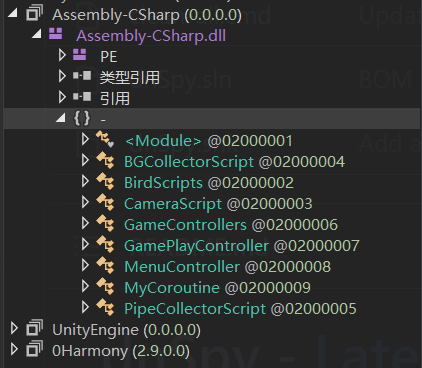

根据类名可以知道每个类的主要功能，与小鸟有关的功能实现在`BirdScripts`类中，有关于游戏控制的实现在`GameControllers`类和`GamePlayController`类中

首先分析`BirdScripts`类

`BirdScripts`类派生自`MonoBehaviour`，其中的`Awake`方法在加载实例时调用

```cs
    private void Awake()
    {
        if (BirdScripts.instance == null)
        {
            BirdScripts.instance = this;
        }
        this.isAlive = true;
        this.score = 0;
        this.flapButton = GameObject.FindGameObjectWithTag("FlapButton").GetComponent<Button>();
        this.flapButton.onClick.AddListener(delegate()
        {
            this.flapTheBird();
        });
        this.CameraX();
    }
```

该方法主要是对小鸟的初始化，设置小鸟存活状态为true，设置分数0，绑定按钮事件等

`FixUpdate`用于物理计算，循环调用

```cs
    private void FixedUpdate()
    {
        if (this.isAlive)
        {
            Vector3 position = base.transform.position;
            position.x += this.forwardSpeed * Time.deltaTime;
            base.transform.position = position;
            if (this.didFlap)
            {
                this.didFlap = false;
                this.myRigidBody.velocity = new Vector2(0f, this.bounceSpeed);
                this.audioSource.PlayOneShot(this.flapClick);
                this.anim.SetTrigger("Flap");
            }
            if (this.myRigidBody.velocity.y >= 0f)
            {
                base.transform.rotation = Quaternion.Euler(0f, 0f, 0f);
            }
            else
            {
                float z = Mathf.Lerp(0f, -70f, -this.myRigidBody.velocity.y / 7f);
                base.transform.rotation = Quaternion.Euler(0f, 0f, z);
            }
        }
    }
```

主要逻辑是移动小鸟坐标，执行flap操作后为小鸟设置y方向上的速度向量，播放音乐，播放动画，当y方向上速度向量为0时小鸟不旋转，当y方向上速度向量小于0时小鸟绕z轴旋转

另外两个重要方法分别是`OnCollisionEnter2D`而`OnTriggerEnter2D`

```cs
    private void OnCollisionEnter2D(Collision2D target)
    {
        if (target.gameObject.tag == "Pipe" || target.gameObject.tag == "Ground" || target.gameObject.tag == "Enemy")
        {
            if (this.isAlive)
            {
                this.isAlive = false;
                this.anim.SetTrigger("BirdDied");
                this.audioSource.PlayOneShot(this.diedClip);
                GamePlayController.instance.playerDiedShowScore(this.score);
            }
        }
        else if (target.gameObject.tag == "Flag" && this.isAlive)
        {
            this.isAlive = false;
            this.audioSource.PlayOneShot(this.cheerClip);
            GamePlayController.instance.finishGame();
        }
    }
```

当小鸟刚体碰撞时调用`OnCollisionEnter2D`方法，发生碰撞后，根据目标的标签判断游戏失败或游戏胜利

当碰撞的物体为管道`Pipe`、地面`Ground`或敌人`Enemy`时，设置小鸟死亡，播放音乐，勃发动画，显示死亡分数等；当碰撞物体为棋子`Flag`时，游戏胜利

```cs
    private void OnTriggerEnter2D(Collider2D target)
    {
        if (target.tag == "PipeHolder")
        {
            this.audioSource.PlayOneShot(this.pointClip);
            this.score++;
            GamePlayController.instance.setScore(this.score);
        }
    }
```

当小鸟进入附加到该对象的触发碰撞体时调用`OnTriggerEnter2D`方法，该方法判断小鸟是否进入管道间隙`PipeHolder`，进入到管道间隙时分数加一，更新排名显示的分数

`instance`成员保存当前的小鸟实例

```cs
    public static BirdScripts instance;
```

`myRigidBody`成员保存当前小鸟的刚体物理组件

### 游戏破解

- #### 修改和重新编译C#程序集实现

根据上述分析可以了解，`OnCollisionEnter2D`内实现小鸟的碰撞检测，删除该方法内触发小鸟死亡的分支，可实现无敌效果，`OnTriggerEnter2D`内实现分数计算，修改该方法，可实增加游戏分数的效果

```cs
    private void OnCollisionEnter2D(Collision2D target)
    {
        if (target.gameObject.tag == "Flag" && this.isAlive)
        {
            this.isAlive = false;
            this.audioSource.PlayOneShot(this.cheerClip);
            GamePlayController.instance.finishGame();
        }
    }
    private void OnTriggerEnter2D(Collider2D target)
    {
        if (target.tag == "PipeHolder")
        {
            this.audioSource.PlayOneShot(this.pointClip);
            this.score += 233;
            GamePlayController.instance.setScore(this.score);
        }
    }
```

dnSpy修改方法并重新编译，替换原`Assembly-CSharp.dll`程序集，运行游戏测试

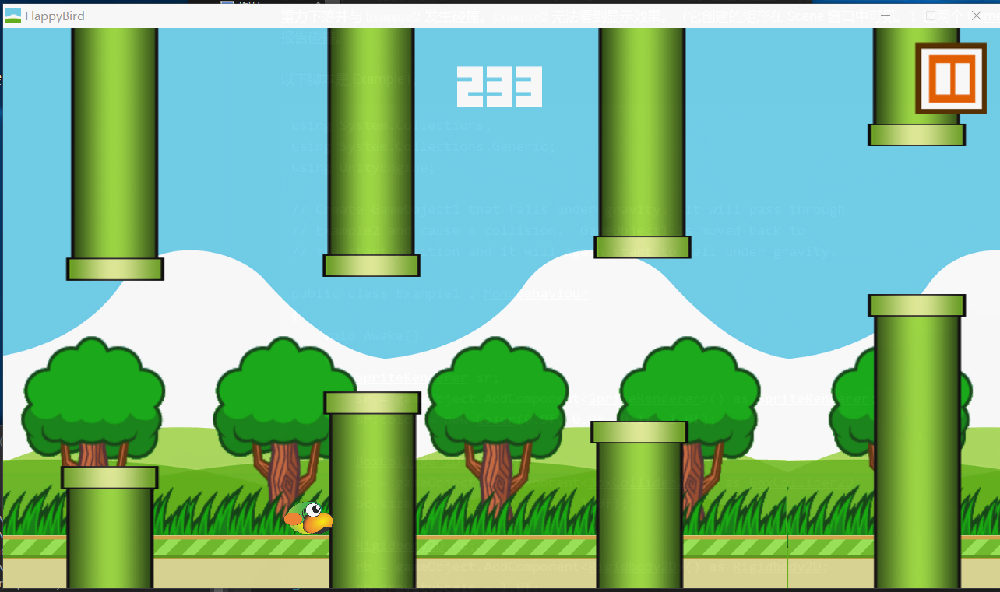

无敌功能和分数修改功能已实现

- #### Cheat Engine动态修改实现

开始游戏，暂停后使用CE打开游戏进程，选择`Mono->.Net Info`查看进程加载的模块信息，选择`Assembly-CSharp->BirdScript`模块

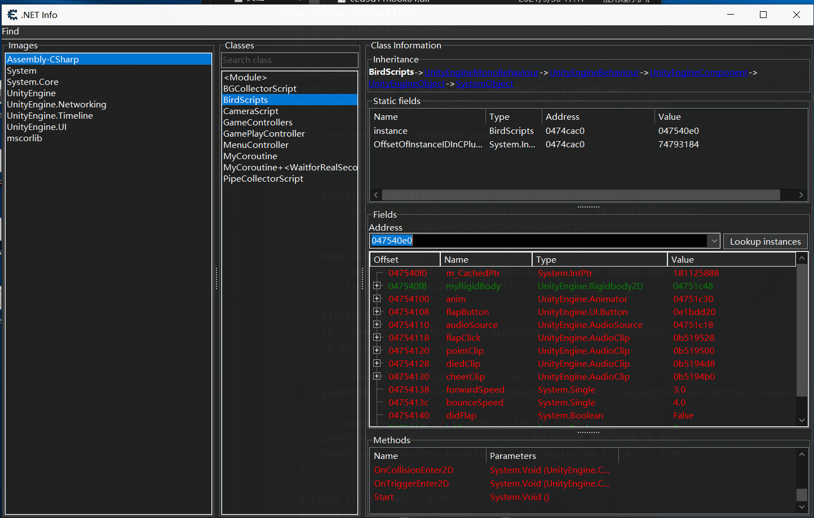

`instance`为当前的小鸟实例，可以查看当前小鸟实例的成员属性和方法

可以查看和修改`OnCollisionEnter2D`和`OnTriggerEnter2D`的JIT代码

先分析`OnCollisionEnter2D`的JIT代码，主要分析跳转指令

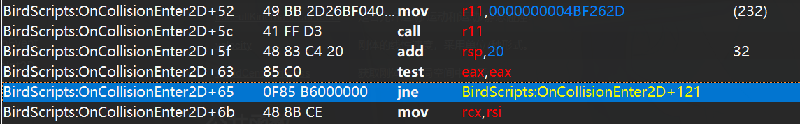

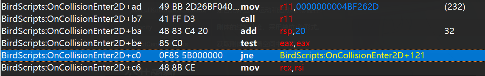

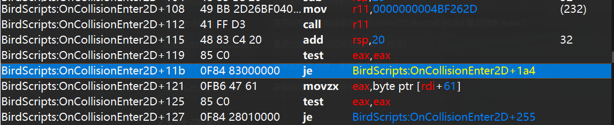

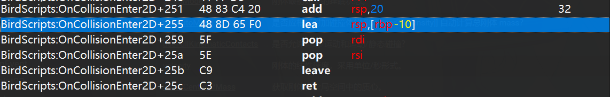

根据之前的源代码可以轻松分析处这部分调整是判断小鸟是否碰撞到会死亡的物体，当或语句中有任意一条成立时，跳转到`0x121`行执行，如果或语句中3条判断都不成立，跳转到`0x1a4`行，进入到`0x121`行后，会判断小鸟的`isAlive`是否为`false`，为`false`跳转到`0x255`行退出调用，否则执行后续代码

另一个判断是否碰撞到棋子的分支类似

将第`0x127`行分支修改为强制跳转，不执行后续代码，即可绕过小鸟死亡代码的执行

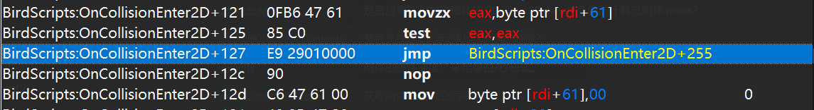

回到游戏进行测试


小鸟的无敌效果已经实现

查看`OnTriggerEnter2D`方法的JIT代码

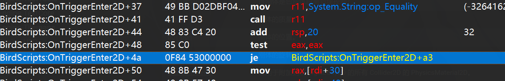

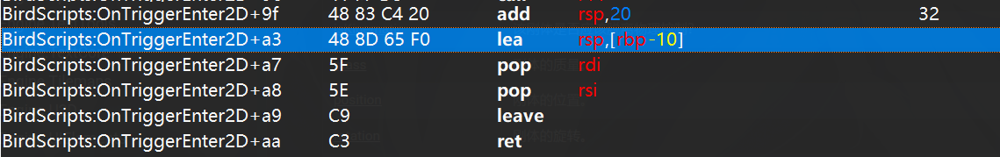

很明显，`0x4a`行判断是否进入到管道间隙，中间的代码为修改分数的部分


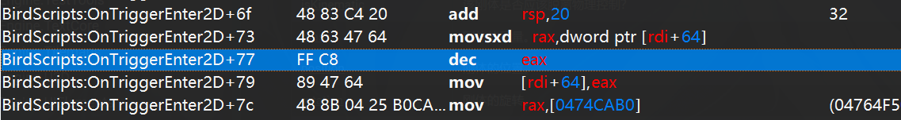

将`0x77`行inc指令修改为dec指令，使小鸟进入管道间隙分数减1

回到游戏进行测试

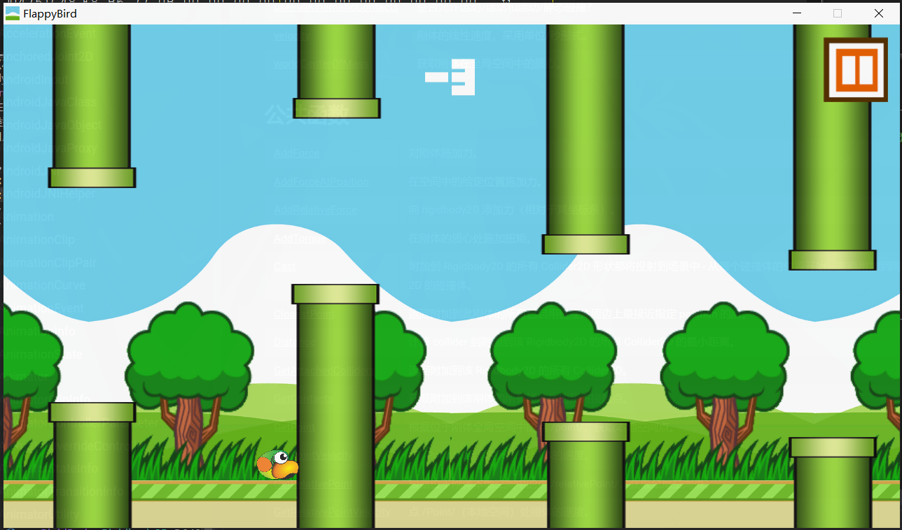

分数减为复数

也可以通过修改小鸟实例下的`score`实现分数修改

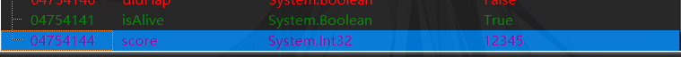

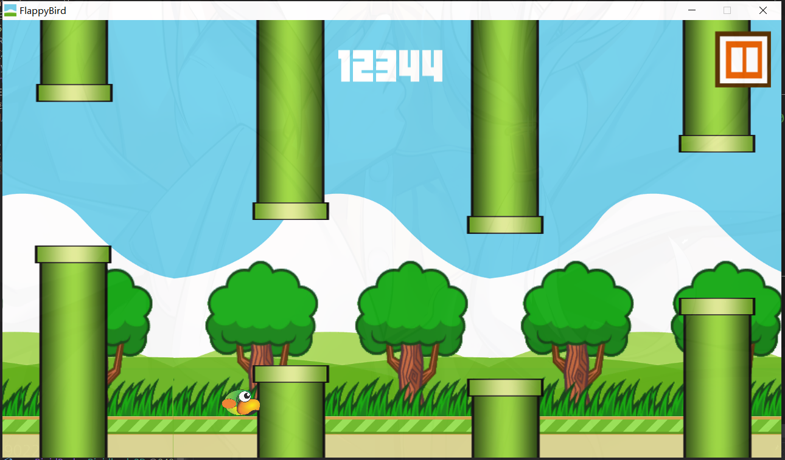

- #### UnityExplorer动态分析游戏

> UnityExplorer可以使用BepInEx、MelonLoader和Standalone三种加载方式加载，测试发现BepInEx的效率要高一点，比MelonLoader加载要流畅很多，而且BepInEx的文档更完善，方便插件的开发，因此后续使用BepInEx加载UnityExplorer进行分析，同时安装ConfigurationManager便于插件的管理和配置

BepInEx和UnityExplorer的安装在仓库Readme中都很详细，注意版本即可，此处选择的是BepInEx 5.4.22版本，安装后启用`Logging.Console`设置，方便查看日志信息

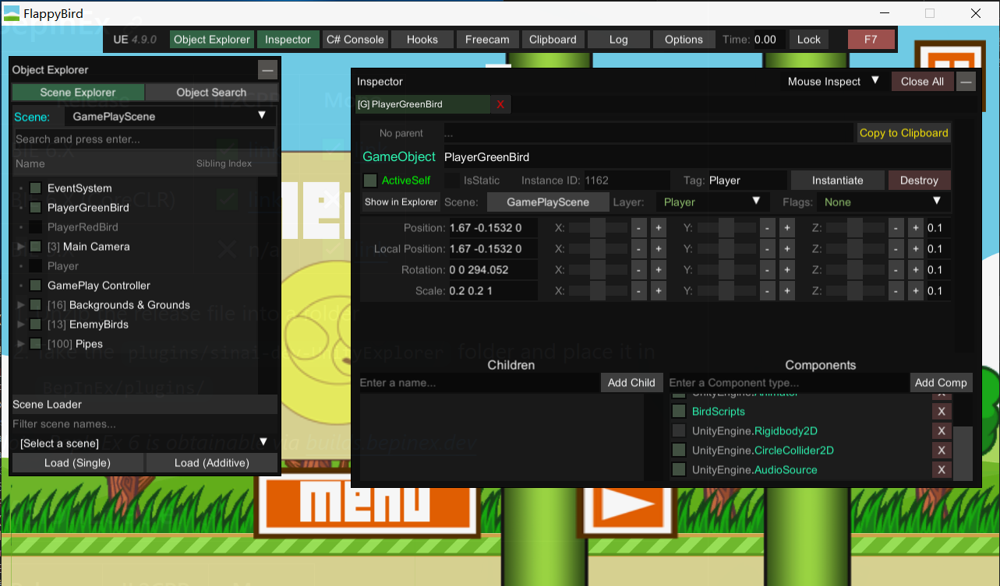

在UnityExplorer中能看到小鸟的位置信息和加载的组件信息，主要关注`RigidBody2D`组件和`CircleCollider2D`组件

`RigidBody2D`组件是小鸟的刚体组件信息，`gravityScale`变量是刚体受重力的影响程度，将其修改为0可实现不受重力影响，实现漂浮效果，但需要同时将速度向量`velocity`变量修改为0，避免小鸟持续向上或向下飞行，还需要将小鸟的`bounceSpeed`修改为0，避免手贱点到屏幕让小鸟增加y方向的速度

`CircleCollider2D`是小鸟的碰撞组件信息，将`enable`修改为false可关闭小鸟的碰撞

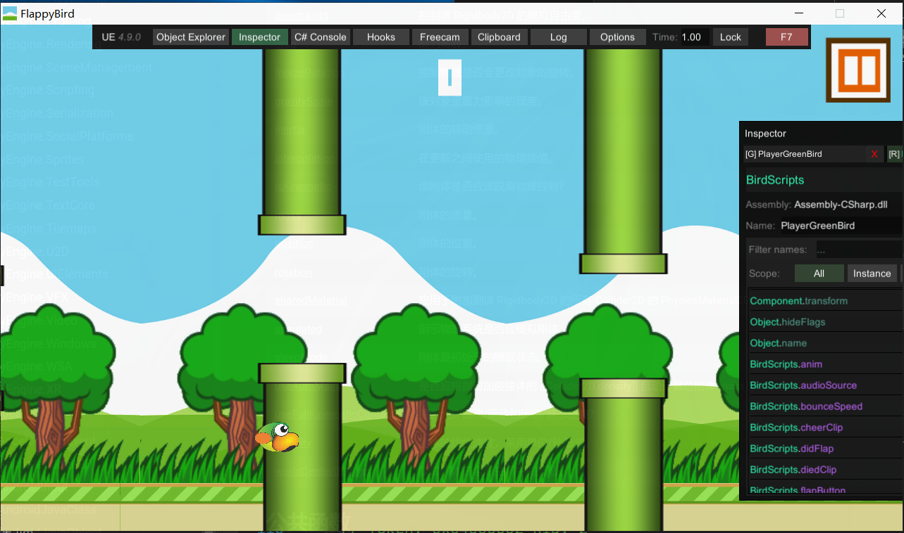

修改后就实现了小鸟的悬浮飞行和穿墙效果，但是由于禁用了碰撞组件，因此不会检测与管道间隙的碰撞，分数不会增加，接触棋子也不会结束游戏，想要保存穿墙效果的同时能够增加分数，可以将所有管道、敌人的碰撞组件禁用

- #### BepInEx实现游戏插件

上述的修改方法中，除了修改程序集重新编译，另外两种均为手动修改，而且重新加载游戏后修改会失效，并且实现的功能有限，因此后续选择编写程序集的方法进行游戏破解

课堂视频中已经展示了使用`SharpMonoInjector`工具注入程序集实现破解功能，但是仍然需要手动注入，~~不够优雅~~，因此这里选择用BepInEx插件的形式实现

插件开发文档：

> https://docs.bepinex.dev/articles/dev_guide/plugin_tutorial/index.html
> 
> [从0开始教你使用BepInEx为unity游戏制作插件Mod - 3DM Mod站](https://mod.3dmgame.com/read/3)

~~没写过C#代码，代码可能不够规范~~

`Plugin.cs`是插件的入口类代码，`Plugin`类派生自`BaseUnityPlugin`

`GlobalVariables.cs`是代码使用的全局变量类，主要保存插件的配置信息已经从游戏内获取的对象信息

```cs
public static class GlobalVariables
{
    // 全局变量
    public static BirdScripts birdInstances; // 当前小鸟实例
    public static Rigidbody2D birdRigidbody2D; // 小鸟的Rigidbody2D组件
    public static Collider2D birdCollider2D; // 小鸟的Collider2D组件
    public static GameObject[] pipes; // 管道
    public static GameObject[] pipeHolders; // 管道间隙
    public static GameObject[] enemies; // 敌人
    public static GameObject[] flags; // flag
    public static ConfigEntry<bool> invincible; // 无敌
    public static ConfigEntry<bool> collision; // 碰撞
    public static ConfigEntry<bool> fly; // 飞行
    public static ConfigEntry<float> speed; // 游戏速度
    public static ConfigEntry<int> score; // 分数
}
```

`Cheat.cs`是插件作弊功能的核心实现

下面依次进行分析

与`MonoBehaviour`类似，`BaseUnityPlugin`中的`Awake`方法在类实例加载时执行，该方法内用于绑定插件的设置，便于在ConfigurationManager插件中图形化地修改参数配置

```cs
private void Awake()
{
    // 插件启用时调用
    Logger.LogInfo($"Plugin {PluginInfo.PLUGIN_NAME} is loaded!");
    // 创建配置项
    GlobalVariables.invincible = Config.Bind("Config", "invincible", false, "碰撞无敌");
    GlobalVariables.invincible.Value = false;
    GlobalVariables.collision = Config.Bind("Config", "collision", true, "开启碰撞");
    GlobalVariables.collision.Value = true;
    GlobalVariables.fly = Config.Bind("Config", "fly", false, "开启飞行");
    GlobalVariables.fly.Value = false;
    GlobalVariables.score = Config.Bind("Config", "score", 0, "游戏分数");
    GlobalVariables.score.Value = 0;
    GlobalVariables.speed = Config.Bind("Config", "speed", 3f, "移动速度");
    GlobalVariables.speed.Value = 3f;
    // 关闭碰撞的回调函数
    GlobalVariables.collision.SettingChanged += (sender, args) => Cheat.instance.SetCollision(GlobalVariables.collision.Value);
    // 飞行回调函数
    GlobalVariables.fly.SettingChanged += (sender, args) => Cheat.instance.SetFly(GlobalVariables.fly.Value);
    // 修改分数的回调函数
    GlobalVariables.score.SettingChanged += (sender, args) => Cheat.instance.SetScore(GlobalVariables.score.Value);
    // 修改游戏速度的回调函数
    GlobalVariables.speed.SettingChanged += (sender, args) => Cheat.instance.SetSpeed(GlobalVariables.speed.Value);
}
```

`Start`方法在所有插件加载后调用，此处用于实例化`Cheat`类对象

```cs
private void Start()
{
    // 所有插件全部加载后调用
    Logger.LogInfo($"Plugin {PluginInfo.PLUGIN_NAME} is started!");
    Cheat.instance = new Cheat();
    Cheat.instance.Start();
}
```

`Update`方法会在游戏的每一帧调用，循环执行，此处用于调用`Cheat`类的`Update`方法

```cs
private void Update()
{
    // 持续执行
    // Debug.Log($"Plugin {PluginInfo.PLUGIN_NAME} is Update!");
    Cheat.instance.Update();
}
```

`OnGUI`方法用于在屏幕上显示标签，并显示当前开启的作弊功能

```cs
private void OnGUI()
{
    // 在游戏界面上显示标签
    GUI.skin.label.fontSize = 18;
    GUI.skin.label.normal.textColor = Color.blue;
    string labelText = "FlappyBird Cheat Plugin\n";
    labelText += "written by noxke\n";
    labelText += "[F1] : config and more feature\n";
    labelText += "[ESC] : pause\n";
    labelText += $"[1/2] invincible [{GlobalVariables.invincible.Value}]\n";
    labelText += $"[3/4] : collision [{GlobalVariables.collision.Value}]\n";
    labelText += $"[5/6] : fly [{GlobalVariables.fly.Value}]\n";
    labelText += "[9] : add score\n";
    labelText += "[up/down/left/right] : move\n";
    labelText += "[0] : finish game\n";
    labelText += $"speed [{GlobalVariables.speed.Value}]";
    GUI.Label(new Rect(10, 10, 400, 300), labelText);
}
```

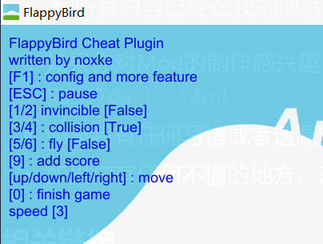

`Cheat`类为作弊功能的实现

类加载时调用`Start`方法，进而调用`SetPatch`方法

```cs
public void SetPatch()
// 设置勾取函数
{
    // patch OnCollisionEnter2D方法
    Harmony harmony1 = new Harmony("com.noxke.patch1");
    MethodInfo onCollisionEnter2D = AccessTools.Method(typeof(BirdScripts), "OnCollisionEnter2D");
    harmony1.Patch(onCollisionEnter2D, prefix: new HarmonyMethod(typeof(Cheat).GetMethod("PrefixOnCollisionEnter2D")));
    Debug.Log("Patch OnCollisionEnter2D");

    // patch flapTheBird方法
    Harmony harmony2 = new Harmony("com.noxke.patch2");
    MethodInfo flapTheBird = AccessTools.Method(typeof(BirdScripts), "flapTheBird");
    harmony2.Patch(flapTheBird, prefix: new HarmonyMethod(typeof(Cheat).GetMethod("PrefixFlapTheBird")));
    Debug.Log("Patch flapTheBird");
}
```

`SetPatch`方法内利用`Harmony`提供的`Patch`功能勾取`BirdScripts`类的`OnCollisionEnter2D`方法和`flapTheBird`方法，由于`OnCollisionEnter2D`是`private`方法，需要使用反射的方法设置Patch

在`OnCollisionEnter2D`方法被调用前执行`Cheat`类的`PrefixOnCollisionEnter2D`方法，判断发生碰撞的是否为管道、大地或者敌人，如果是，则跳过屏蔽`OnCollisionEnter2D`方法的执行，屏蔽小鸟的死亡，如果为其他情况，即碰到棋子，则会执行原方法，触发游戏胜利

```cs
public static bool PrefixOnCollisionEnter2D(BirdScripts __instance, Collision2D target)
{
    // 在发生碰撞前拦截
    if (GlobalVariables.invincible.Value != true)
    {
        return true;
    }
    // 碰撞到flag的时候胜利，不做拦截
    if (target.gameObject.tag == "Pipe" || target.gameObject.tag == "Ground" || target.gameObject.tag == "Enemy")
    {
        Debug.Log($"Collision {target.gameObject.tag}");
        return false;
    }
    return true;
}
```

在`flapTheBird`方法调用前，即屏幕被点击触发小鸟向上飞之前，执行`Cheat`类的`PrefixFlapTheBird`方法，主要用来在飞行状态中屏蔽flap操作，避免小鸟获得向上的向量速度飞出屏幕~~为什么不之间修改bounceSpeed???~~

```cs
public static bool PrefixFlapTheBird(BirdScripts __instance)
{
    // 在flap前调用
    // 避免飞行时flap然后无法减速
    Debug.Log("Patch flapTheBird");
    if (GlobalVariables.fly.Value == true)
    {
        return false;
    }
    return true;
}
```

`Update`方法循环调用，用于设置按键绑定，从游戏内获取对象，已经同步游戏分数到配置

```cs
public void Update()
{
    // 循环调用
    KeyBound(); // 按键检测
    GetObjects(); // 获取游戏对象
    if (GlobalVariables.birdInstances != null)
    {
        GlobalVariables.score.Value = GlobalVariables.birdInstances.score; // 同步分数
    }
}
```

`KeyBound`方法用于监听按键操作，调用`Cheat`中的功能

```cs
private void KeyBound()
{
    // 按键绑定
    if (Input.GetKey(KeyCode.Escape))
    {
        // ESC暂停 鼠标太难点了
        if (GamePlayController.instance != null)
        {
            Debug.Log("key ESC down, pause");
            GamePlayController.instance.pauseGame();

   }
}
```

`GetObjects`方法从游戏中获取小鸟的实例，获取小鸟的组件信息，获取游戏中的管道对象、管道间隙对象等

```cs
public void GetObjects()
{
    // 获取游戏内对象和实例
    GlobalVariables.birdInstances = BirdScripts.instance; // 获取当前小鸟实例
    if (GlobalVariables.birdInstances != null)
    {
        // 获取小鸟的组件
        GlobalVariables.birdCollider2D = GlobalVariables.birdInstances.GetComponent<Collider2D>();
        GlobalVariables.birdRigidbody2D = GlobalVariables.birdInstances.GetComponent<Rigidbody2D>();
    }
    GlobalVariables.pipes = GameObject.FindGameObjectsWithTag("Pipe");  // 管道
    GlobalVariables.pipeHolders = GameObject.FindGameObjectsWithTag("PipeHolder"); // 获取当前的管道间隙
    GlobalVariables.enemies = GameObject.FindGameObjectsWithTag("Enemy");  // 敌人
    GlobalVariables.flags = GameObject.FindGameObjectsWithTag("Flag");  // flag
}
```

小鸟的穿墙功能，即屏蔽碰撞的功能在`SetCollision`方法中实现

```cs
public void SetCollision(bool value)
{
    // 设置管道和敌人的碰撞
    GlobalVariables.collision.Value = value;
    for (int i = 0; i < GlobalVariables.pipes.Length; i++)
    {
        BoxCollider2D pipeBoxCollider2D = GlobalVariables.pipes[i].GetComponent<BoxCollider2D>();
        if (pipeBoxCollider2D != null)
        {
            pipeBoxCollider2D.enabled = value;
        }
    }
    for (int i = 0; i < GlobalVariables.enemies.Length; i++)
    {
        BoxCollider2D enemyBoxCollider2D = GlobalVariables.enemies[i].GetComponent<BoxCollider2D>();
        if (enemyBoxCollider2D == null)
        {
            Collider2D enemyCollider2D = GlobalVariables.enemies[i].GetComponent<Collider2D>();
            if (enemyCollider2D != null)
            {
                enemyCollider2D.enabled = value;
            }
        }
        else
        {
            enemyBoxCollider2D.enabled = value;
        }
    }
    Debug.Log($"collision : {value}");
}
```

这里实现的方法不是禁用小鸟的碰撞组件，因为会影响游戏得分，使用的是禁用游戏中管道、敌人的碰撞组件

`SetFly`方法开启悬浮飞行，设置小鸟的重力影响为0，将速度向量设为0

```cs
public void SetFly(bool value)
{
    if (value == true)
    {
        // 关闭重力影响
        GlobalVariables.birdRigidbody2D.gravityScale = 0f;
        // 速度向量设为0
        GlobalVariables.birdRigidbody2D.velocity = new Vector2(0f, 0f);
    }
    else
    {
        // 恢复重力影响
        GlobalVariables.birdRigidbody2D.gravityScale = 1f;
    }
    Debug.Log($"fly : {value}");
}
```

`SetSocre`修改游戏分数，并刷新分数显示

```cs
public void SetScore(int value)
{
    // 设置游戏分数
    GlobalVariables.birdInstances.score = value;
    GamePlayController.instance.setScore(value);
    Debug.Log($"set score  {value}");
}
```

`SetSpeed`设置x方向移动速度，由于`forwardSpeed`是`BirdScripts`的私有成员，不能能够小鸟的实例来直接修改，需要使用反射机制修改

```cs
public void SetSpeed(float value)
{
    // 设置x轴速度
    GlobalVariables.speed.Value = value;
    // 私有成员需要使用反射修改
    FieldInfo privateField = typeof(BirdScripts).GetField("forwardSpeed", BindingFlags.NonPublic | BindingFlags.Instance);
    if (privateField != null)
    {
        privateField.SetValue(GlobalVariables.birdInstances, value);
        Debug.Log($"forward speed : {value}");
    }
}
```

`BirdMove`将小鸟向指定方向移动

```cs
public void BirdMove(float x, float y)
{
    if (GlobalVariables.birdInstances != null)
    {
        Vector3 basePosition = GlobalVariables.birdInstances.transform.position;
        basePosition.x += x;
        basePosition.y += y;
        GlobalVariables.birdInstances.transform.position = basePosition;
        Debug.Log($"move bird x : {x}, y : {y}");
    }
}
```

`FinishGame`触发游戏胜利，播放胜利音效

```cs
public void FinishGame()
{
    // 游戏胜利
    if (GlobalVariables.birdInstances != null)
    {
        GlobalVariables.birdInstances.isAlive = false;
        // 需要利用反射调用私有方法和获取私有变量
        FieldInfo cheerClipFiled = typeof(BirdScripts).GetField("cheerClip", BindingFlags.NonPublic | BindingFlags.Instance);
        AudioSource audioSource = GlobalVariables.birdInstances.GetComponent<AudioSource>();
        audioSource.PlayOneShot((AudioClip)cheerClipFiled.GetValue(GlobalVariables.birdInstances));
        GamePlayController.instance.finishGame();
        Debug.Log("finish game!");
    }
}
```

编译插件得到`CheatPlugin.dll`，复制到plugins插件文件下启动游戏

```powershell
PS C:\workspace\腾讯菁英班\外挂实现分析-PC端\CheatPlugin> dotnet build; cp .\bin\Debug\net35\CheatPlugin.dll ..\FlappyBird_BepInEx\BepInEx\plugins\
MSBuild version 17.3.2+561848881 for .NET
  正在确定要还原的项目…
  所有项目均是最新的，无法还原。
  CheatPlugin -> C:\workspace\腾讯菁英班\外挂实现分析-PC端\CheatPlugin\bin\Debug\net35\CheatPlugin.dll

已成功生成。
    0 个警告
    0 个错误

已用时间 00:00:00.69
```

根据GUI提示，F1打开控制菜单，ESC暂停游戏，1/2切换无敌，3/4切换碰撞，5/6切换飞行，9增加分数，0结束游戏，上下左右控制小鸟移动


