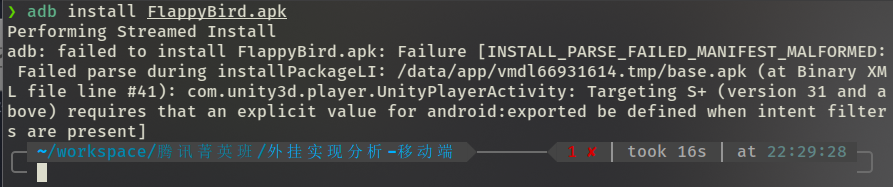
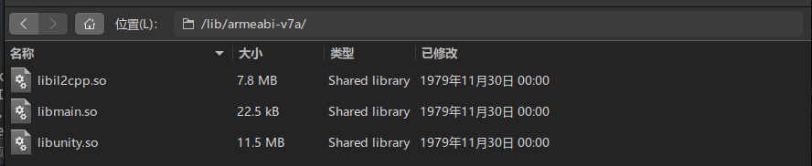
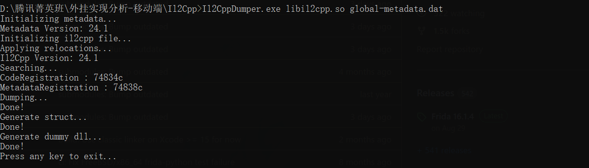
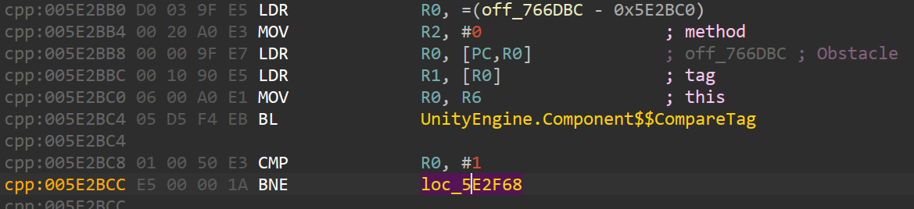
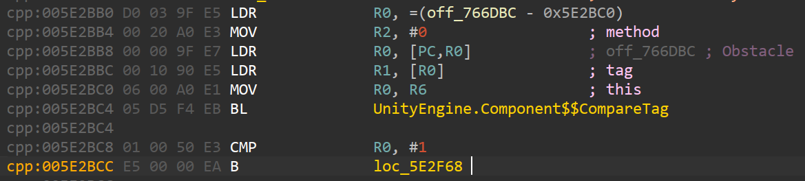
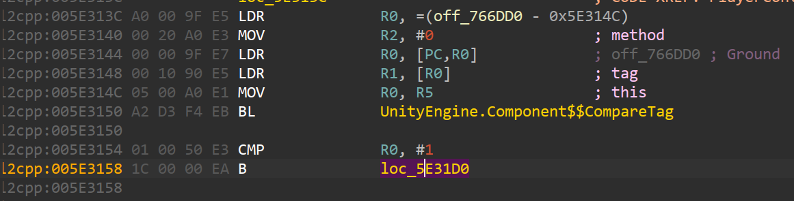
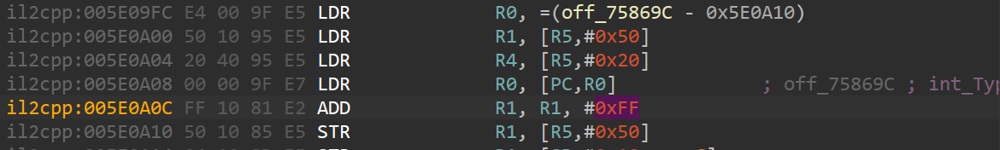
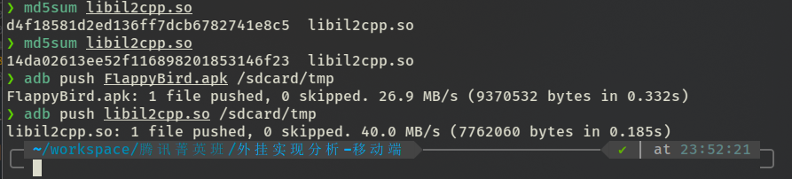
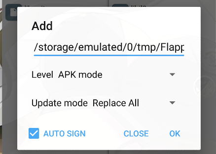
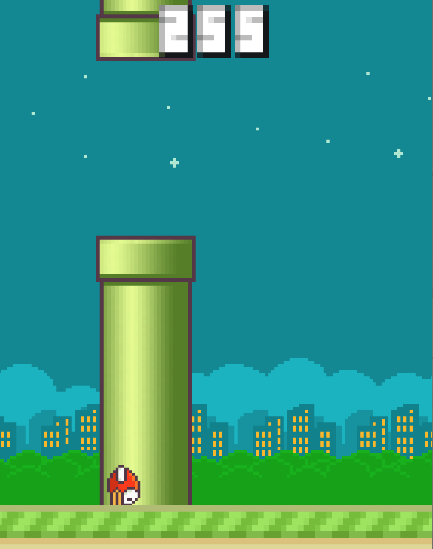

<div>
<center>
<h3>
外挂实现分析-移动篇
<h3>
  </center>
</div>

### 游戏分析

使用工具如下:

> root设备(nikel lineageos14 Android7.1.2)
> 
> [Il2CppDumper v6.7.40](https://github.com/Perfare/Il2CppDumper)
> 
> [dnSpy v6.1.8](https://github.com/dnSpy/dnSpy)
> 
> [IDA Pro 7.7](https://hex-rays.com/IDA-pro/)
> 
> [mt文件管理器](https://bbs.binmt.cc/forum-2-1.html)
> 
> [friad 16.1.4](https://github.com/frida/frida)

安装FlappyBird.apk进行测试



看来安卓版本太高还不让装，添加`android:exported='true'`之后虽然能装上，但是启动黑屏，老老实实用低版本安卓分析算了

由于是Unity游戏，没必要分析Java层，直接查看libs文件价下的lib文件



看到`libil2cpp.so`文件，显然，这道题使用的是Unity il2cpp的方式，游戏逻辑在`libil2cpp.so`文件中，没有函数导出符号，分析难度较大。

从apk中提取处`libil2cpp.so`和`global-metadata.dat`，使用Il2CppDumper工具提取符号信息



提取得到的文件有`DummyDll`下的DLL文件，`il2cpp.h`结构体信息，`script.json`符号信息，`DummyDll`下的`Assembly-CSharp.dll`可以用dnSpy打开，分析C#类方法和成员，但是只有符号信息，没有方法实现

分析一下类名，可以知道玩家控制的逻辑在`PlayerController`类中实现，游戏控制和计分逻辑在`GameManager`类中实现

`PlayerController`类中需要关注以下几个方法

```cs
// Token: 0x0600002C RID: 44 RVA: 0x00002050 File Offset: 0x00000250
[Token(Token = "0x600001A")]
[Address(RVA = "0x5E23E4", Offset = "0x5E23E4", VA = "0x5E23E4")]
private void Update()
{
}

// Token: 0x0600002D RID: 45 RVA: 0x00002050 File Offset: 0x00000250
[Token(Token = "0x600001B")]
[Address(RVA = "0x5E2788", Offset = "0x5E2788", VA = "0x5E2788")]
private void LateUpdate()
{
}

// Token: 0x0600002E RID: 46 RVA: 0x00002050 File Offset: 0x00000250
[Token(Token = "0x600001C")]
[Address(RVA = "0x5E2A70", Offset = "0x5E2A70", VA = "0x5E2A70")]
private void OnTriggerEnter2D(Collider2D col)
{
}

// Token: 0x0600002F RID: 47 RVA: 0x00002050 File Offset: 0x00000250
[Token(Token = "0x600001D")]
[Address(RVA = "0x5E30C8", Offset = "0x5E30C8", VA = "0x5E30C8")]
private void OnCollisionEnter2D(Collision2D col)
{
}

// Token: 0x06000030 RID: 48 RVA: 0x00002050 File Offset: 0x00000250
[Token(Token = "0x600001E")]
[Address(RVA = "0x5E2FAC", Offset = "0x5E2FAC", VA = "0x5E2FAC")]
public void KillPlayer()
{
}
```

`GameManager`类中需要关注`UpdateScore`方法

```cs
// GameManager
// Token: 0x06000006 RID: 6 RVA: 0x00002050 File Offset: 0x00000250
[Token(Token = "0x6000006")]
[Address(RVA = "0x5E09BC", Offset = "0x5E09BC", VA = "0x5E09BC")]
public void UpdateScore()
{
}
```

上述方法的实现都在`libil2cpp.so`文件中，下面使用ida32分析该文件

使用idapython加载`Il2CppDumper`的`ida_with_struct_py3.py`脚本，选择`script.json`和`il2cpp.h`文件，恢复函数名和结构体

- `PlayerController__Update`
  
  ```cpp
  void PlayerController__Update(PlayerController_o *this)
  {
      if ( this->fields.start )
      {
          tiltSmooth = this->fields.tiltSmooth;
          UnityEngine_Quaternion__Lerp(&v32, v33[0], v28, tiltSmooth * deltaTime, 0);
          UnityEngine_Transform__set_rotation(transform, v32, 0);
      }
      else
      {
          UnityEngine_Transform__set_localPosition(v16, v34, 0);
      }
      UnityEngine_Transform__set_rotation(v17, v29, 0);
  }
  ```
  
  主要是设置旋转，设置位置

- `PlayerController__LateUpdate`
  
  ```cpp
  void PlayerController__LateUpdate(PlayerController_o*this)
  {
      if (Instance->fields.start && UnityEngine_Input__GetMouseButtonDown(0, 0))
      {
          UnityEngine_Rigidbody2D__set_gravityScale(this->fields.playerRigid, 1.0, 0);
          this->fields.tiltSmooth = this->fields.minTiltSmooth;
          UnityEngine_Transform__set_rotation(transform, this->fields.upRotation, 0);
          UnityEngine_Vector2__get_zero(&value, 0);
          UnityEngine_Rigidbody2D__set_velocity(playerRigid, value, 0);
          UnityEngine_Vector2__get_up(&v11, 0);
          UnityEngine_Vector2__op_Multiply_2987556(&force, v11, this->fields.thrust, 0);
          UnityEngine_Rigidbody2D__AddForce(v7, force, 0);
      }
      UnityEngine_Rigidbody2D__get_velocity(&value, this->fields.playerRigid, 0);
      if (value.fields.y < -1.0)
      {
          this->fields.tiltSmooth = this->fields.maxTiltSmooth;
          UnityEngine_Rigidbody2D__set_gravityScale(v9, 2.0, 0);
      }
  }
  ```
  
  这个函数的内容相对就多一些类，但是根据函数名很容易分析出功能，主要是两个if内的内容，第一个if当屏幕被点击时进入，把小鸟的刚体组件重力影响`gravityScale`修改为1.0，将刚体组件的速度向量`velocity`设置为0，为刚体组件施加一个y反向的力，大小为`this->fields.thrust`，该部分的目的是让小鸟有一个向上的速度；第二个if先判断向下的速度，当向下速度小于1.0时增大刚体的重力影响

- `PlayerController__OnTriggerEnter2D`
  
  ```cpp
  void PlayerController__OnTriggerEnter2D(PlayerController_o*this, UnityEngine_Collider2D_o* col)
  {
      if (UnityEngine_Component__CompareTag(transform, (System_String_o*)StringLiteral_3006, 0))
      {
          GameManager__UpdateScore(GameManager_TypeInfo->static_fields->Instance, v7);
      }
      else
      {
          if (UnityEngine_Component__CompareTag(v8, (System_String_o*)StringLiteral_3014, 0))
          {
              PlayerController__KillPlayer(this, v29);
          }
      }
  }
  ```
  
  这里主要是两个`CompareTag`，第一个`CompareTag`比较进入的物体是否为`Score`，如果是`Score`则调用`GameManager__UpdateScore`更新游戏分数，第二个`CompareTag`比较进入的物体是否为`Obstacle`，如果是`Obstacle`则调用`PlayerController__KillPlayer`触发死亡

- `PlayerController__OnCollisionEnter2D`
  
  ```cpp
  void PlayerController__OnCollisionEnter2D(PlayerController_o*this, UnityEngine_Collision2D_o* col,)
  {
      if (UnityEngine_Component__CompareTag(transform, (System_String_o*)StringLiteral_3015, 0))
      {
          PlayerController__KillPlayer(this, v6);
      }
  }
  ```
  
  这里只有一个`CompareTag`，比较碰撞的物体是否为`Ground`，是`Ground`则调用`PlayerController__KillPlayer`触发死亡

- `PlayerController__KillPlayer`
  
  ```cpp
  void __fastcall PlayerController__KillPlayer(PlayerController_o *this)
  {
      GameManager__EndGame(GameManager_TypeInfo->static_fields->Instance, method);
      UnityEngine_Vector2__get_zero(&v5, 0);    
      UnityEngine_Rigidbody2D__set_velocity(playerRigid, v5, 0);
  }
  ```
  
  调用`GameManager__EndGame`结束游戏，将小鸟刚体速度向量设置为0

- `GameManager__UpdateScore`
  
  ```cpp
  void GameManager__UpdateScore(GameManager_o *this)
  {
      gameScoreText = this->fields.gameScoreText;
      v4 = this->fields.gameScore + 1;
      this->fields.gameScore = v4;
      SoundManager__PlayTheAudio(SoundManager_TypeInfo->static_fields->Instance, (System_String_o*)StringLiteral_3005, v8);
  }
  ```
  
  分数+1，刷新分数显示，播放音乐

#### Patch二进制文件破解

在上面分析里面可以知道有两个`CompareTag`分支会触发死亡，只要Patch掉这两个分支，就可以轻松实现无敌效果，至于能不能关闭小鸟与管道的碰撞，可以猜测管道属于`Obstacle`，地面属于`Ground`，因此小鸟可以穿过管道，但是不会穿过地面

汇编界面查看这两个分支



这里是`PlayerController__OnTriggerEnter2D`的死亡分支，比较进入的物体是否为`Obstacle`，当比较结果不为1时调整到函数末尾返回，否则进入后续代码触发死亡，将BNE修改为B指令即可



继续查看`PlayerController__OnCollisionEnter2D`中的`CompareTag`分支，与上面的情况类似，将BNE修改为B指令



分数的更新在`GameManager__UpdateScore`中，将分数加一进行修改即可实现修改游戏分数，修改如下，将加一修改为加0xFF



保存修改并上传到手机



使用mt文件管理器将修改后的libil2cpp.so添加到apk中重新打包签名



安装测试



无论是碰撞地面还是管道，都不会死亡，并且一次得分为255分，游戏破解完成

#### frida一把梭

将frida-server上传到手机，编写python脚本附加到游戏

```python
def on_message(message, data):
    if message['type'] == 'send':
        print("[*] {0}".format(message['payload']))
    else:
        print(message)

def main():
    device = frida.get_usb_device()
    app = device.get_frontmost_application()
    process = device.attach(app.pid)

    while (True):
        jscode = ""
        print("[0] : 退出")
        print("[1] : 开启无敌")
        print("[2] : 关闭无敌")
        print("[3] : 开启飞行")
        print("[4] : 关闭飞行")
        print("[5] : 加分数")
        # print("[9] : hook测试")
        choice = int(input(">> "))
        match choice:
            case 0:
                break
            case 1:
                jscode = invincible_js
            case 2:
                jscode = off_invincible_js
            case 3:
                jscode = fly_js
            case 4:
                jscode = off_fly_js
            case 5:
                jscode = add_score_js
            # case 9:
            #     jscode = hook_js
            case _:
                print("输入错误")
        script = process.create_script(jscode)
        script.on('message', on_message)
        script.load()

    process.detach()

if __name__ == "__main__":
    main()
```

实现的功能有无敌、飞行和加分数，下面分别分析frida脚本内容

- 开启无敌
  
  ```js
  Java.perform(() => {
      var libil2cpp = Process.findModuleByName("libil2cpp.so");
      // OnTriggerEnter2D
      var offset1 = 0x5E2BCC;
      var addr1 = libil2cpp.base.add(offset1);
      var arr1 = [0xE5, 0x00, 0x00, 0xEA]; // B 0x5E2F68
      // 修改内存保护
      Memory.protect(addr1, 0x1000, 'rwx');
      Memory.writeByteArray(addr1, arr1);
      // OnCollisionEnter2D
      var offset2 = 0x5E30CC;
      var addr2 = libil2cpp.base.add(offset2);
      var arr2 = [0x40, 0x00, 0x00, 0xEA]; // B 0x5E31D4
      // 修改内存保护
      Memory.protect(addr2, 0x1000, 'rwx');
      Memory.writeByteArray(addr2, arr2);
  });
  ```
  
  其实就是对内存中`CompareTag`的分支进行修改，将BNE修改为B指令，需要注意的是地址需要用基地址+相对偏移的方式得到，修改前需要修改段保护权限

- 关闭无敌
  
  ```js
  Java.perform(() => {
      var libil2cpp = Process.findModuleByName("libil2cpp.so");
      // OnTriggerEnter2D
      var offset1 = 0x5E2BCC;
      var addr1 = libil2cpp.base.add(offset1);
      var arr1 = [0xE5, 0x00, 0x00, 0x1A]; // BNE 0x5E2F68
      // 修改内存保护
      Memory.protect(addr1, 0x1000, 'rwx');
      Memory.writeByteArray(addr1, arr1);
      // OnCollisionEnter2D
      var offset2 = 0x5E30CC;
      var addr2 = libil2cpp.base.add(offset2);
      var arr2 = [0x18, 0xB0, 0x8D, 0xE2]; // ADD R11, SP, #0x18
      // 修改内存保护
      Memory.protect(addr2, 0x1000, 'rwx');
      Memory.writeByteArray(addr2, arr2);
  });
  ```
  
  将两条指令改回来

- 开启飞行
  
  ```js
  Java.perform(() => {
      var libil2cpp = Process.findModuleByName("libil2cpp.so");
      // 在LateUpdate函数中有设置重力的部分, 将数值修改为0.125减轻重力的影响
      var offset1 = 0x5E289C;
      var addr1 = libil2cpp.base.add(offset1);
      var arr1 = [0x3D, 0x14, 0xA0, 0xE3]; // MOV R1. #0x3D000000 0.03125
      // 修改内存保护
      Memory.protect(addr1, 0x1000, 'rwx');
      Memory.writeByteArray(addr1, arr1);
      var offset2 = 0x5E2A38; 
      var addr2 = libil2cpp.base.add(offset2);
      var arr2 = [0x3D, 0x14, 0xA0, 0xE3]; // MOV R1. #0x3D000000 0.03125
      // 修改内存保护
      Memory.protect(addr1, 0x1000, 'rwx');
      Memory.writeByteArray(addr1, arr1);
      // 将tiltSmooth修改为maxTiltSmooth的分支patch掉
      var offset3 = 0x5E2A14; 
      var addr3 = libil2cpp.base.add(offset3);
      var arr3 = [0x0A, 0x00, 0x00, 0xEA]; // B 0x5E2A44
      // 修改内存保护
      Memory.protect(addr3, 0x1000, 'rwx');
      Memory.writeByteArray(addr3, arr3);
      // 还需要将thrust推力减小
      // 由于不能直接拿到PlayerController的实例,需要先hook Update, 获得实例之后才能继续修改
      var pc_instance = NULL;
      var func_offset = 0x5E23E4; // PlayerController__Update
      var func_addr = libil2cpp.base.add(func_offset);
      // 函数对象
      var targetFunc = new NativeFunction(func_addr, 'void', ['pointer']);
      // hook
      Interceptor.attach(targetFunc, {
          onEnter: function (args) {
              // send(args[0]);
              pc_instance = args[0];
              Interceptor.detachAll();
              send(`PlayerController Instance: ${pc_instance}`);
              var thrust_ptr = pc_instance.add(0xC); // 偏移0xC
              Memory.writeFloat(thrust_ptr, 50);
              var thrust = Memory.readFloat(thrust_ptr);
              send(thrust);
          }
      });
  });
  ```
  
  开启飞行稍微有点复杂，首先需要修改刚体的重力，由于很难通过地址去之间修改重力值，并且前面分析知道在Update中会持续修改重力，直接改内存不可行，所以选择Patch修改重力部分的代码，原来的代码中一处设置重力为2.0，一处为1.0，这里将其修改为0.03125，这个值16进制表示方便，至于为什么不设置为0，是为了放置小鸟飞出屏幕，这里将其改小实现缓降的效果；tiltSmooth会影响小鸟下落的速度（貌似是旋转速度，没仔细测试，顺便改了），把tiltSmooth修改为maxTiltSmooth的分支patch掉的分支Patch掉；另外还影响飞行效果的就是点击屏幕时小鸟往上飞，需要将向上飞的效果减弱，不然容易飞出屏幕，经过前面的分析可以知道点击屏幕后会给小鸟一个向上的力，这个力保存在`this->fields.thrust`中，想要找到这个值，需要首先知道`PlayerController`实例的位置，但是显然没法直接得到，所以需要使用其他的方式来获取实例的地址，因为`Update`方法在每帧都会调用，并且第一个参数就是`PlayerController`的实例，所以可以直接hook`Update`函数，读取第一个参数，得到所需的实例地址，再根据偏移，得到`this->fields.thrust`的指针，经过测试可以知道施加的向上的力大小默认为225，这里改为50，减小向上飞的效果

- 关闭飞行
  
  ```js
  Java.perform(() => {
      var libil2cpp = Process.findModuleByName("libil2cpp.so");
      // 在LateUpdate函数中有设置重力的部分, 恢复其数值
      var offset1 = 0x5E289C;
      var addr1 = libil2cpp.base.add(offset1);
      var arr1 = [0xFE, 0x15, 0xA0, 0xE3]; // MOV R1, #0x3F800000
      // 修改内存保护
      Memory.protect(addr1, 0x1000, 'rwx');
      Memory.writeByteArray(addr1, arr1);
      var offset2 = 0x5E2A38;
      var addr2 = libil2cpp.base.add(offset2);
      var arr2 = [0x01, 0x11, 0xA0, 0xE3]; // MOV R1, #0x40000000
      // 修改内存保护
      Memory.protect(addr1, 0x1000, 'rwx');
      Memory.writeByteArray(addr1, arr1);
      // 将tiltSmooth修改为maxTiltSmooth的分支恢复
      var offset3 = 0x5E2A14; 
      var addr3 = libil2cpp.base.add(offset3);
      var arr3 = [0x0A, 0x00, 0x00, 0x5A]; // BPL 0x5E2A44
      // 修改内存保护
      Memory.protect(addr3, 0x1000, 'rwx');
      Memory.writeByteArray(addr3, arr3);
      // 恢复thrust推力
      // 由于不能直接拿到PlayerController的实例,需要先hook Update, 获得实例之后才能继续修改
      var pc_instance = NULL;
      var func_offset = 0x5E23E4; // PlayerController__Update
      var func_addr = libil2cpp.base.add(func_offset);
      // 函数对象
      var targetFunc = new NativeFunction(func_addr, 'void', ['pointer']);
      // hook
      Interceptor.attach(targetFunc, {
          onEnter: function (args) {
              // send(args[0]);
              pc_instance = args[0];
              Interceptor.detachAll();
              send(`PlayerController Instance: ${pc_instance}`);
              var thrust_ptr = pc_instance.add(0xC); // 偏移0xC
              Memory.writeFloat(thrust_ptr, 225);
              var thrust = Memory.readFloat(thrust_ptr);
              send(`thrust: ${thrust}`);
          }
      });
  });
  ```
  
  开启飞行的逆过程

- 修改分数
  
  ```js
  Java.perform(() => {
      var libil2cpp = Process.findModuleByName("libil2cpp.so");
      // 读取GameManager_TypeInfo
      var gm_info_addr = libil2cpp.base.add(0x7690F0);
      var gm_info = Memory.readPointer(gm_info_addr);
      var gm_static_filed_addr = gm_info.add(0x5C); // 结构体偏移0x5C
      var gm_static_filed = Memory.readPointer(gm_static_filed_addr);
      var gm_instance = Memory.readPointer(gm_static_filed); // 偏移0x00
      var gm_score_ptr = gm_instance.add(0x50); // 分数偏移0x50
      var gm_score = Memory.readS32(gm_score_ptr);
      Memory.writeS32(gm_score_ptr, gm_score+100); // 加100分
      gm_score = Memory.readS32(gm_score_ptr); // 修改分数
      send(`game score: ${gm_score}`);
  });
  ```
  
  改分和设置飞行类似，需要通过实例找偏移再找到要改的数据的位置，但是`GameManager`是个静态类，直接有导出的地址，经过几次偏移就能得到，修改内存就能改分，这里直接加100分，遗憾的一点是改完后不会自动刷新，需要游戏触发一次更新分数才会显示，本来是想用frida调用`UpdateScore`函数的，但是调用的时候一直出错，所有没能实现自动刷新的效果

使用未修改的游戏安装包安装测试：


