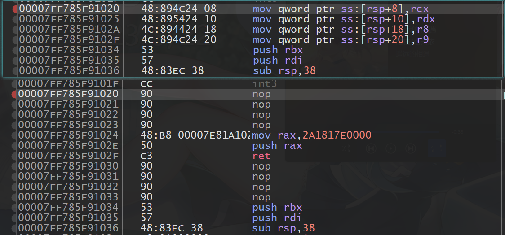

<div>
<center>
<h3>
客户端安全开发基础-PC篇
<h3>
</center>
</div>

---

> writen by noxke

---

#### 1.程序分析

使用ida打开crackme.exe，进入到程序的主逻辑函数，注意到有大量的xmm寄存器，但是不含call指令，先忽略，注意到两个特殊部分：


左图中调用了CreateThread函数创建子线程运行StartAddress处函数，右侧含有分支判断，完成判断后sleep并返回，猜测该处与程序的判断逻辑有关

F5查看反编译代码


末尾进行了数据串的比较，后根据比较结果为v32地址处的4个字节赋值，紧接着两个字节赋值`0x0a,0x0d`，换行回车符号，猜测v32地址处为输出字符串，结合测试时的输出`错误`，猜测`0xCBF9DBB4 0x8FFFCBD5`经过异或后为gbk编码格式的字符串，在线编码工具测试，猜测成立


显然，v37处储存的内容影响最后的输出结果，对`v32=v37`下断点启动调试，随意输入字符串后在该处断下，查看v32内容


显然, v37为输入的原内容，根据比较部分可以得知，`v37-48`处为flag


得到程序flag`HiGWDUuXQS6wVHBTp0ERfJe6VqprMqD1`


分析剩余部分得到程序的输入函数和输出函数，后续将称其为`printf scanf`


#### 2.DLL注入分析

题目要求使用`CreateRemoteThread`api进行注入

> 最基础的代码注入方式, 使用[`CreateRemoteThread`](https://learn.microsoft.com/en-us/windows/win32/api/processthreadsapi/nf-processthreadsapi-createremotethread)在目标进程下创建远程线程, 调用[`LoadLibraryA`](https://learn.microsoft.com/en-us/windows/win32/api/libloaderapi/nf-libloaderapi-loadlibrarya)加载DLL到目标进程, DLL加载/卸载时调用`DllMain`函数, 执行注入DLL中的代码, `LoadLibraryA`参数需要先写入目标进程的内存, 使用[`VirtualAllocEx`](https://learn.microsoft.com/en-us/windows/win32/api/memoryapi/nf-memoryapi-virtualallocex)在目标进程内存下分配内存, 使用[`WriteProcessMemory`](https://learn.microsoft.com/en-us/windows/win32/api/memoryapi/nf-memoryapi-writeprocessmemory)将需要注入的DLL地址写入目标内

```c
hProcess = OpenProcess(PROCESS_ALL_ACCESS, FALSE, dwPID);
pRemoteBuf = VirtualAllocEx(hProcess, NULL, dwBufSize, MEM_COMMIT, PAGE_READWRITE);
WriteProcessMemory(hProcess, pRemoteBuf, dllPath, dwBufSize, NULL);
hMod = GetModuleHandleA((LPCSTR)"kernel32.dll");
pThreadProc = (LPTHREAD_START_ROUTINE)GetProcAddress(hMod, "LoadLibraryA");
CreateRemoteThread(hProcess, NULL, 0, pThreadProc, pRemoteBuf, 0, NULL);
```

> 创建远程线程时传入的`LoadLibraryA`地址并不是直接获取目标进程中的函数地址, 因为系统DLL在不同进程中加载地址相同

编写一个输出字符串的DLL进行注入测试


注入creackme.exe失败，但注入其他程序正常，重新分析代码，分析`CreateThread`函数创建的线程执行的`StartAddress`处代码，找到关键位置


此处将`LoadLibraryExW`函数的内存权限修改为可写入，然后将第一个字节patch成-61（0xC3, ret指令），将指令第一行修改为ret指令，将`LoadLibraryExW`函数patch掉了，因此`LoadLibraryA`函数也无法正常使用


不过中间有20秒的sleep,在启动后就注入即可


#### 3.hook代码

将输出结果修改称正确，patch一下分支语句或者将错误的gbk编码patch成正确就可以，但是题目要求用DLL注入hook程序，因此此处用注入的DLL修改程序，hook掉`printf`函数，思路如下

> 将`printf`前几行指令修改为跳转指令，跳转到注入的shellcode中，在shellcode中判断`printf`的参数（即待输出的字符串）是否为`错误`，如果为`错误`，将其修改为`正确`，替换完成后在shellcode中执行`printf`前几行被替换的指令，然后返回到`printf`函数继续执行，输出修改后的字符串

printf修改前后代码:



修改前前4条指令为将寄存器参数压入堆栈，此处将其修改为

```nasm
mov eax, $shellcode
push rax
ret
```

将shellcode的地址压入堆栈中，使用ret指令跳转到shellcode代码出，shellcode代码如下（前后填充的nop省略）


主要代码为

```nasm
mov eax, [rcx]         ; 将printf第一个参数(输出字符串)的前四个字节传送到eax
cmp eax, 0xF3CEEDB4    ; 判断这四个字节是否为错误两个字的gbk编码
jne $+0x8              ; 不是错误两个字的gbk编码则跳过接下来两条指令
mov eax, 0xB7C8FDD5    ; 如果是错误两个字的gbk编码，将其修改为正确两个字的gbk编码
mov [rcx], eax         ; 将这四个字节写回输出字符串，完成替换
;原printf函数前4条指令    ; 为printf完成参数压栈
mov rax, $printf+0x20  ; printf的指令位置，跳过修改的代码
push rax               ; push ret压栈返回
ret
```

只需要在注入的DLL中计算printf的地址，将地址写入shellcode,将shellcode写入可执行内存，再hook掉printf的代码即可完成修改操作

设置hook代码如下：

```c
void set_hook()
{
    // hook printf函数
    DWORD64 pProc;
    DWORD64 pProcOffset = 0x1020;
    HMODULE hModule = GetModuleHandle(nullptr);
    DWORD_PTR baseAddress = reinterpret_cast<DWORD_PTR>(hModule);
    pProc = (DWORD64)baseAddress + pProcOffset;

    printf("\nhook proc addr : 0x%llx\n", pProc);
    // 修改shellcode中的返回地址 printf+0x10
    *((DWORD64 *)((uint8_t *)shellcode + 0x50 - 0x1A)) = (pProc + 0x10);
    // 写入shellcode
    LPVOID shellcodeBuf = VirtualAlloc(NULL, 0x50, MEM_COMMIT, PAGE_EXECUTE_READWRITE);
    memcpy(shellcodeBuf, shellcode, 0x50);
    DWORD64 dwShellcodeBuf = (DWORD64)shellcodeBuf;
    printf("\nshell code addr : 0x%llx\n", dwShellcodeBuf);
    // 修改函数内存保护权限
    VirtualProtect((LPVOID)pProc, 20, PAGE_EXECUTE_READWRITE, NULL);
    // 修改hookcode中的shellcode地址
    *((DWORD64 *)((uint8_t *)hookcode + 6)) = dwShellcodeBuf;
    // 获取进程句柄
    HANDLE hProcess = GetCurrentProcess();
    // hook printf函数
    WriteProcessMemory(hProcess, (LPVOID)pProc, hookcode, 20, NULL);
}
```

由于PE文件加载时会进行重定向操作，所以printf函数的地址不固定，需要通过PE文件加载的基地址+函数偏移量得到printf函数的准确地址，另外shellcode需要申请可执行内存块确保指令可以正常执行，需要修改printf函数的内存块可写，修改其前几行指令

注入后运行程序，任意输入均返回正确


