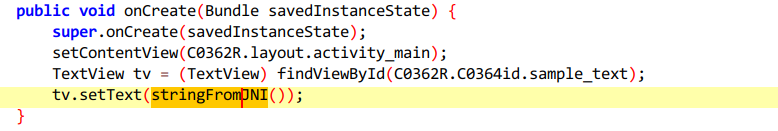
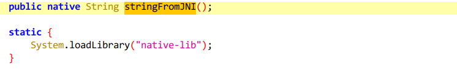
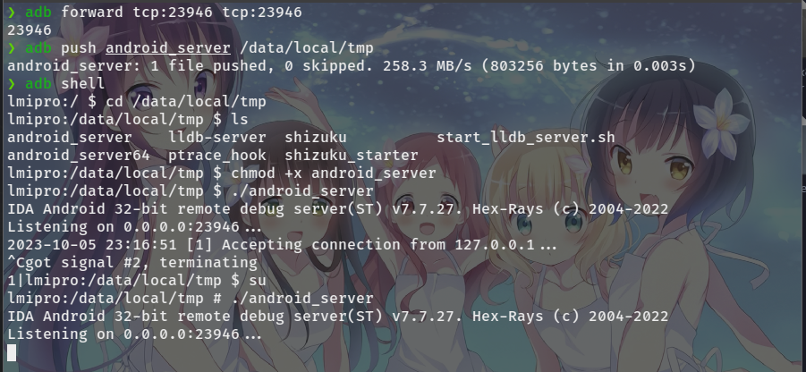
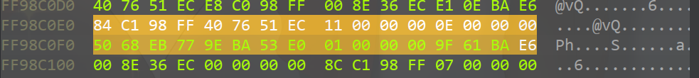
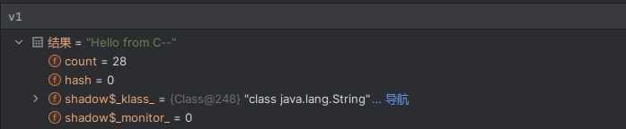
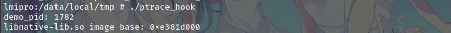

<div>
<center>
<h3>
客户端安全开发基础-移动篇
<h3>
</center>
</div>

---

> written by noxke

---

#### 1.静态分析

###### Java层

使用jadx打开题目`gslab.demo.apk`文件，查看`AndroidManifest.xml`文件获取软件入口activity为`com.example.x86demo.MainActivity`

查看该入口activity类的`onCreate`方法



TextView对象`tv`设置的字符串来自`stringFromJNI`方法



查看其余部分，`stringFromJNI`是`native-lib`中的native函数

###### Native层

该软件提供了`armabi-v7a`和`x86`两种处理器架构的`libnative-lib.so`文件，此处对arm架构so文件进行分析

使用readelf命令查看`libnative-lib.so`的导出函数


`stringFromJNI`导出函数的偏移地址为`0x08bdd`，完整导出名称为`Java_com_example_x86demo_MainActivity  
_stringFromJNI`

> arm指令集每条指令长度为32位，存在指令对其，指令地址低两位均为0，而此处偏移地址最低位为1，表示处理器执行到该处时进入Thumb模式，指令长度变为16位或32位，实际指令偏移地址为`0x8bdc`

使用ida32打开`libnative-lib.so`文件，定位到导出函数，指令长度大多为16位，表示处理器执行该函数时处于Thumb模式

反编译查看该函数


程序使用C++的string类构造string对象并返回，注意到除了`sub_E36E2CA6`函数外其它函数均为库函数，因此选择该函数进行hook

#### 2.动态调试

> 使用真机(android 13)进行调试，调试工具为android studio和ida

###### Java层

对`stringFromJNI`调用处的smali代码下断点，连接设备进行调试


程序在断点处断下，单步跳过查看`stringFromJNI`函数的返回值(v1寄存器)


函数返回结果为字符串对象`Hello from C++`

继续运行程序，屏幕显示`Hello from C++`字符串

###### Native层

开启adb端口转发，将ida的dbgsrv上传到手机，进入shell切换到root权限启动dbgsrv



android studio上开启调试，程序在smali代码断下

ida对`stringFromJNI`函数下断点，连接调试器并附加到`com.example.x86demo`进程，按F9继续运行


android studio单步执行，ida上程序在`stringFromJNI`函数断下


> 此处处理器处于Thumb模式

断点到`sub_E3722CA6`函数内部


函数只做了参数传递并调用`sub_E3723258`函数，`sub_E3722CA6`的参数为`R0`寄存器，值为`0xFF98C0E8`，显然为一个地址，跳转到该地址处



猜测该位置为一个结构体，结构体第一个整数为0x11，第二个整数为0x0E，第三个整数为`0x77EB6850`，第三个数明显为地址，跳转到该地址处


该地址处为字符串`Hello from C++`，对该字符串进行修改测试


ida使用F9运行，android studio单步断下，查看`stringFromJNI`返回值



返回值变为了上面修改的字符串，继续运行程序，屏幕上显示修改后的字符串


#### 3.使用ptrace注入并hook程序

> 上述分析中选择`sub_E36E2CA6`函数进行hook，该函数偏移为`0x8ca6`，后续称为`proc`
> 
> 该函数的调用关系为`onCreate->stringFromJNI->proc`，由于该函数在程序启动时执行，几乎没有等待时间，所以在正常执行的情况下不能够保证100%hook成功

本题使用traphook的方式修改proc函数的参数，思路如下：

1. ptrace在proc函数开始位置设置软件断点

2. waitpid捕获进程停止信息

3. ptrace获取proc函数参数R0寄存器，得到字符串地址

4. ptrace修改字符串地址处的字符串

5. ptrace禁用断点，恢复程序执行

###### 代码实现

ptrace函数需要待附加进程的pid，使用`pidof com.example.x86demo`命令可以获得软件的`pid`

想要hook `proc`函数，需要知道其内存中的加载地址，在静态分析中得到了其偏移地址`proc_offset = 0x8ca6`，还需要`libnative-lib.so`文件加载的基地址才能计算出`proc`函数的地址，安卓进程加载的库文件信息可以在`/proc/pid/maps`文件中找到


如图，本次程序运行`libnative-lib.so`的加载地址为`lib_base = e381d000`，`proc`函数的地址为`proc_addr = lib_base + proc_offset`

c语言中使用popen函数执行命令行目录并获取结果

```c
    // 获取进程pid和libnative-lib.so加载的基地址
    while (1)
    {
        fp = popen("pidof com.example.x86demo && cat /proc/`pidof com.example.x86demo`/maps | grep libnative-lib.so", "r");
        fread(cli_output, 1, 1024, fp);
        pclose(fp);
        if (strlen(cli_output) != 0)
        {
            sscanf(cli_output, "%d%lx", &demo_pid, &lib_base);
            if (lib_base == 0)
            {
                continue;
            }
            printf("demo_pid: %d\n", demo_pid);
            printf("libnative-lib.so image base: 0x%lx\n", lib_base);
            break;
        }
    }
```



使用ptrace附加到进程并将`proc`函数第一条指令修改为软件断点，设置断点前需要保存原始指令，确保后续能够使程序正确运行，设置断点后恢复进程运行

```c
unsigned int bp_code = 0x0000BEFF;  // 设置FF号断点
// 需要hook的函数偏移
unsigned long proc_offset = 0x8ca6;
// 需要hook的函数地址
unsigned long proc_addr = lib_base + proc_offset;
    // 附加到目标进程
ptrace(PTRACE_ATTACH, pid, NULL, NULL);
waitpid(pid, &status, 0);
// 先保存断点前的指令，再将其设置为断点代码
ori_code = ptrace(PTRACE_PEEKDATA, pid, (void *)proc_addr, NULL);
ptrace(PTRACE_POKEDATA, pid, (void *)proc_addr, (void *)bp_code);
printf("set breakpoint at 0x%lx\n", proc_addr);
ptrace(PTRACE_CONT, pid, NULL, NULL);
```

当处理器执行到软件断点时会发出`SIGTRAP`信号，使用waitpid捕获断点信号，并获取寄存器信息，判断PC寄存器地址是否为断点地址

```c
// 捕获断点
while (1)
{
    waitpid(pid, &status, 0);
    if (WIFSTOPPED(status) && WSTOPSIG(status) == SIGTRAP)
    {
        // 获取寄存器信息
        ptrace(PTRACE_GETREGS, pid, NULL, &regs);
        unsigned long pc = regs.uregs[15];
        printf("break at 0x%lx\n", pc);
        if (pc == proc_addr)
        {
            // hook操作
        }
    }
    ptrace(PTRACE_CONT, pid, NULL, NULL);
}
```

当程序在设置的断点处断下后，寄存器R0的值为proc函数的参数，其值为地址，`R0+8`为字符串地址，使用ptrace修改`R0+8`处的字符串，实现对`stringFromJNI`返回值的修改

完成修改后需要将断点恢复为原始指令

```c
// 获取R0寄存器
unsigned long r0 = regs.uregs[0];
unsigned long str_addr = ptrace(PTRACE_PEEKDATA, pid, (void *)(r0 + 8), NULL);
char ori_str[0x20];
char new_str[0x20];
strcpy(new_str, hack_str);
for (int i = 0; i < 0x20; i += 4)
{
    *(unsigned long *)(ori_str + i) = ptrace(PTRACE_PEEKDATA, pid, (void *)(str_addr + i), NULL);
    ptrace(PTRACE_POKEDATA, pid, (void *)(str_addr + i), (void *)(*(unsigned long *)(new_str + i)));
}
printf("str at 0x%lx\n", str_addr);
printf("ori str: %s\n", ori_str);
printf("new str: %s\n", new_str);
// 恢复原来的指令
ptrace(PTRACE_POKEDATA, pid, (void *)proc_addr, (void *)ori_code);
```

编译程序并上传到手机测试


> x86的hook实现与arm的实现基本相同，除了`proc`函数的偏移地址不同，以及断点指令不同以外，还需要注意x86处理器在执行int3断点后会将EIP+1，捕获断点后除了将断点指令恢复，还需要将EIP寄存器恢复
