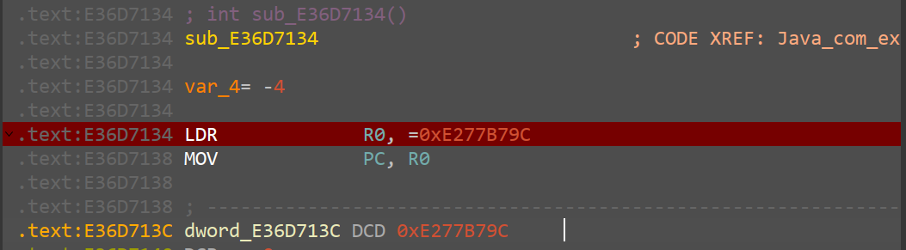

<div>
<center>
<h3>
客户端安全开发基础-移动篇
<h3>
</center>
</div>

---

> written by noxke

---

#### 1.Java层分析

使用jadx打开题目apk，查看AndroidManifest.xml获取程序入口Activity为`com.example.crackme1.MainActivity`

查看反编译的`MainActivity`类的`onCreate`方法，分析Java层逻辑

```java
public void onCreate(Bundle savedInstanceState) {
    super.onCreate(savedInstanceState);
    ActivityMainBinding inflate = ActivityMainBinding.inflate(getLayoutInflater());
    this.binding = inflate;
    setContentView(inflate.getRoot());
    Button button = (Button) findViewById(C0462R.C0465id.button);
    this.btn1 = button;
    button.setOnClickListener(new View.OnClickListener() { // from class: com.example.crackme1.MainActivity.1
        @Override // android.view.View.OnClickListener
        public void onClick(View v) {
            EditText textInput = (EditText) MainActivity.this.findViewById(C0462R.C0465id.TextInput);
            String Inputstr = textInput.getText().toString();
            String RetStr = MainActivity.this.stringFromJNI(Inputstr);
            Toast.makeText(MainActivity.this, RetStr, 0).show();
        }
    });
}
```

按钮触发点击事件后，调用`onClick`方法，获取输入框的输入字符串`Inputstr`，将输入字符串`Inputstr`调用`stringFromJNI`方法，并将返回字符串`RetStr`显示为toast消息

查看处理字符串的`stringFromJNI`方法

```java
public native String stringFromJNI(String str);

static {
    System.loadLibrary("crackme1");
}
```

该方法为native文件`libcrackme1.so`中的导出函数

使用Android Studio打开apk文件进行调试，对`onClick`方法中的`stringFromJNI`调用行下断点，开始调试运行


调用`stringFromJNI`前，参数寄存器v0为输入的字符串，单步跳过该行调用，查看返回值


返回值v2寄存器为字符串`Wrong`，继续运行程序，字符串`wrong`以toast消息显示在屏幕上


查看logcat发现，调用`stringFromJNI`函数时程序会打印log信息`Str:...`，并且每次点击按钮调用函数时打印的字符串均不相同

#### 2.Native层分析

分析和调试Java层发现，程序的字符串校验功能位于native层的`stringFromJNI`函数中，该函数为`libcrackme1.so`动态库的导出函数，该库文件位于`crackme1/lib/armeabi-v7a/`目录下，因此程序需要使用支持armabi-v7a的设备运行

使用readelf工具查看`libcrackme1.so`的导出函数


`stringFromJNI`函数偏移地址为`0x1194`，函数偏移最低位为0，Arm模式执行

使用ida32打开`libcrackme1.so`文件查看`stringFromJNI`函数

```c
int __fastcall Java_com_example_crackme1_MainActivity_stringFromJNI(int a1, int a2, int a3)
{
  char *s2; // [sp+Ch] [bp-7Ch]
  char s[100]; // [sp+20h] [bp-68h] BYREF

  s2 = (char *)sub_12A4(a1, a3, 0);
  memset(s, 0, sizeof(s));
  qmemcpy(s, "123", 3);
  sub_F50(5, s);
  if ( !strncmp(s, s2, 5u) || (sub_1134() & 1) != 0 )
    return sub_12EC(a1, "right");
  else
    return sub_12EC(a1, "wrong");
}
```

根据反编译c代码，函数将输入字符串`s2`与`sub_F50`函数生成的字符串s进行比较，当比较结果相同时，返回字符串`right`，不同时返回结果`wrong`

查看`sub_F50`函数

```c
int __fastcall sub_F50(int a1, const char *a2)
{
  unsigned int v2; // r0
  int v3; // r1
  int v5; // [sp+8h] [bp-28h]
  int i; // [sp+14h] [bp-1Ch]
  size_t v9; // [sp+2Ch] [bp-4h]

  v2 = time(0);
  srand(v2);
  for ( i = 0; i < a1; ++i )
  {
    v5 = rand();
    v9 = _strlen_chk(a0123456789abcd, 0x40u);
    sub_2964(v5, v9);
    a2[i] = a0123456789abcd[v3];
  }
  a2[i] = 0;
  return _android_log_print(4, "Crack", "Str:%s", a2);
}
```

该函数生成一个随机字符串，并在log中打印该字符串，因此在log中看到的`Str:...`就是进行比较的字符串

在if判断中，除了比较字符串是否相等，还对`sub_1134`函数返回值进行判断，分析该函数

```c
int sub_1134()
{
  return 0;
}
```


反编译的c代码中该函数直接返回0,但根据汇编代码，该函数内存在打印log信息的函数调用，提示`hook this func to return true`，但该分支永远不会执行，因此logcat中未查看到该log信息，按照提示，后续选择该函数进行hook，其偏移地址为`0x1134`，后续称为`proc`，函数偏移地址最低为为0，Arm模式执行

查看`/proc/pid/maps`文件查看`libcrackme1.so`内存映射信息


`libcrackme1.so`的加载基地址为`0xe36f0000`，因此`stringFromJNI`函数在内存中的地址为`0xe36f1194`

ida对`stringFromJNI`和`proc`下断点，附加到`com.example.crackme1`进程进行调试

调试器附加后发现线程13032触发了SIGABRT信号，导致程序中断，如果继续运行程序将信号传送给进程，程序会崩溃无法调试，该处需要将对产生该信号的线程挂起，并忽略该信号避免该线程恢复运行


在程序输入字符串点击确认按钮，Android Studio单步执行`stringFromJNI`方法，ida在`stringFromJNI`函数入口断下，函数地址为`0xe36f1194`，与上述计算相同


运行到生成随机字符串的函数返回，strcmp之前，查看两个字符串内容


分别为生成的随机字符串和输入字符串，查看log信息


log打印的字符串为函数生成的随机字符串

断点到`proc`函数


对函数的BEQ执行进行修改，使起能够打印log信息，并在函数返回时，将返回值R0寄存器修改为1


出现`hook this func to return true`log信息，继续运行程序，使`stringFromJNI`函数返回


smali代码中`stringFromJNI`返回`right`，继续运行程序，屏幕显示toast消息`right`

#### 3.ptrace注入程序

使用ptrace注入程序大致分为以下几个步骤

- 使用PTRACE_ATTACH附加的进程

- 手动调用malloc函数在进程内分配内存

- 使用PTRACE_WRITE将要注入的so文件路径写入进程内存

- 手动调用dlopen函数将so文件加载到进程内存

- 使用PTRACE_CONT恢复进程运行，使用PTRACE_DETACH从进程脱离

其中需要手动调用的函数`malloc`位于`libc.so`中，函数`dlopen`位于`libdl.so`中，使用readelf查看`libc.so`和`libdl.so`的导出信息

```shell
adb shell
lmipro:/ $ su
lmipro:/ # readelf -s -W /apex/com.android.runtime/lib/bionic/libc.so |\
> grep malloc
   536: 0002d685    76 FUNC    GLOBAL DEFAULT   17 malloc

lmipro:/ # readelf -s -W /apex/com.android.runtime/lib/bionic/libdl.so |\                                                                             
> grep dlopen
    19: 00001849    10 FUNC    WEAK   DEFAULT   10 dlopen
```

`malloc`函数的偏移地址为`0x2d685`，`dlopen`函数的编译地址为`0x1849`，注意到两个函数偏移地址最低位都是1，处理器在执行这两个函数时需要进入Thumb模式

> Armv7a处理器指令集指令长度为4字节，当处理器进入Thumb模式后，指令长度为2字节，或拓展长度为4字节，当PC跳转的目的地址指令最低为为1时，处理器需要进入Thumb模式，置CPSR寄存器第5位为1，当恢复arm模式时，置CPSR寄存器第5位为0
> 
> 
> 
> 在c标准函数调用时，前4个参数依次存放在R0~R3寄存器中，剩余的参数从右向左依次压入栈中，返回地址存放在LR寄存器中，返回值存放在R0寄存器中

使用ptrace手动调用函数时，需要先使用PTRACE_GETREGS保存进程的寄存器信息，然后减小SP寄存器创建栈帧，将函数参数依次存放到R0~R3寄存器中，剩余参数存放到栈中，然后根据函数地址设置PC寄存器和CPSR寄存器，PC寄存器设置为函数地址，最低位置0，根据函数地址最低位设置CPSR寄存器Thumb模式标志为，然后设置LR寄存器为0,使函数返回时，触发错误停止

```c
// PC寄存器，低位决定处理器模式
regs.uregs[15] = ((unsigned long)proc_addr & 0xFFFFFFFE);
// PSR寄存器，第5位决定Thumb模式,根据函数地址最低位确定是否进入Thumb模式
if ((unsigned long)proc_addr & 0x1)
{
    // Thumb模式
    regs.uregs[16] = regs.uregs[16] | 0x20;
}
else
{
    // arm模式
    regs.uregs[16] = regs.uregs[16] & 0xFFFFFFDF;
}
// LR寄存器
regs.uregs[14] = 0;
```

完成寄存器设置后，使用PTRACE_SETREGS将设置进程寄存器为修改后的寄存器，使用PTRACE_CONT恢复进程运行，waitpid等待进程触发返回异常,当进程触发返回异常断下是，waitpid返回状态码为`0xb7f`

```c
if (ptrace_setregs(pid, &regs) != 0 || ptrace_continue(pid) != 0)
{
    printf("call proc 0x%lx failed\n", (unsigned long)proc_addr);
    return NULL;
}
// 等待函数执行完返回错误
waitpid(pid, &status, WUNTRACED);
// printf("0x%x\n", status);
while (status != 0xb7f)
{
    ptrace_continue(pid);
    waitpid(pid, &status, WUNTRACED);
}
```

进程返回后，使用PTRACE_GETREGS获取寄存器，读取返回值R0寄存器，并使用调用函数前保存的寄存器恢复进程寄存器

```c
ptrace_getregs(pid, &regs);
// 返回值在R0中
ret = (void *)regs.uregs[0];
// 恢复寄存器
ptrace_setregs(pid, &saved_regs);
printf("proc 0x%lx return value: 0x%lx\n", (unsigned long)proc_addr, (unsigned long)ret);
return ret;
```

调用`malloc`函数和`dlopen`函数之前，需要获取函数在内存中的加载地址，读取`/proc/self/maps`文件可以得到`libc.so`和`libdl.so`加载的基地址，使用`dlopen`加载so文件，使用`dlsym`可以获得`malloc`和`dlopen`函数在注入器进程中的加载地址，与so文件基地址相减得到偏移地址，然后读取`/proc/pid/maps`文件可以获取待注入进程中`libc.so`和`libdl.so`加载基地址，根据偏移地址得到`malloc`和`dlopen`在待注入进程中的地址

```c
// 获取proc函数的内存地址
void *get_remote_proc_addr(pid_t pid, const char *lib_path, const char *proc_name)
{
    void *handle;
    void *local_module_base;
    void *local_proc_addr;
    unsigned long proc_offset;
    void *remote_module_base;
    void *remote_proc_addr;
    // 在本地加载lib文件并获取proc函数偏移
    handle = dlopen(lib_path, RTLD_LAZY);
    if (handle == NULL)
    {
        printf("open %s failed\n", lib_path);
        return NULL;
    }
    dlerror();
    local_module_base = get_module_base(0, lib_path);
    local_proc_addr = dlsym(handle, proc_name);
    proc_offset = local_proc_addr - local_module_base;
    dlclose(handle);
    printf("%s offset: 0x%lx\n", proc_name, proc_offset);
    remote_module_base = get_module_base(pid, lib_path);
    remote_proc_addr = remote_module_base + proc_offset;
    printf("%s address: 0x%lx\n", proc_name, (unsigned long)remote_proc_addr);
    return remote_proc_addr;
}
```

注入器函数如下

```c
// 注入so到进程
int inject_lib(pid_t pid, const char *lib_path)
{
    int status;
    void *params[10];
    void *proc_malloc;
    void *proc_dlopen;
    void *proc_dlerror;
    void *mem_buf;
    proc_malloc = get_remote_proc_addr(pid, libc_path, "malloc");
    proc_dlopen = get_remote_proc_addr(pid, libdl_path, "dlopen");
    proc_dlerror = get_remote_proc_addr(pid, libdl_path, "dlerror");
    // 首先附加到进程
    ptrace_attach(pid);
    // 调用malloc分配内存写入lib文件路径
    params[0] = (void *)0x100;
    mem_buf = ptrace_call(pid, proc_malloc, 1, params);
    if (mem_buf == NULL)
    {
        printf("malloc memory failed\n");
        ptrace_continue(pid);
        ptrace_detach(pid);
        return -1;
    }
    printf("malloc memory at 0x%lx\n", (unsigned long)mem_buf);
    // 将lib路径写入进程内存
    ptrace_write(pid, mem_buf, strlen(lib_path) + 1, (void *)lib_path);
    // 调用dlopen将lib文件加载到进程
    params[0] = mem_buf;
    params[1] = (void *)RTLD_LAZY;
    if (ptrace_call(pid, proc_dlopen, 2, params) == NULL)
    {
        printf("dlopen load %s to process %d failed\n", lib_path, pid);
        // 调用dlerror查看错误原因
        void *err_addr = ptrace_call(pid, proc_dlerror, 0, params);
        unsigned char err[0x100];
        ptrace_read(pid, err_addr, 0x100, (void *)err);
        printf("%s\n", err);
        ptrace_continue(pid);
        ptrace_detach(pid);
        return -1;
    }
    printf("dlopen load %s to process %d succeed\n", lib_path, pid);
    ptrace_continue(pid);
    ptrace_detach(pid);
    return 0;
}
```

编译注入器上传到手机进行测试

```shell
❯ armv7a-linux-androideabi33-clang -o injector ptrace_injector.c
❯ adb push injector /data/local/tmp
injector: 1 file pushed, 0 skipped. 130.1 MB/s (11088 bytes in 0.000s)

❯ adb shell
lmipro:/ $ su
lmipro:/ # cd /data/local/tmp
lmipro:/data/local/tmp # ./injector com.example.crackme1 /data/local/tmp/libhook.so
pid of com.example.crackme1: 21551
/apex/com.android.runtime/lib/bionic/libc.so at 0xf6a52000
malloc offset: 0x2d685
/apex/com.android.runtime/lib/bionic/libc.so at 0xeac4f000
malloc address: 0xeac7c685
/apex/com.android.runtime/lib/bionic/libdl.so at 0xf6a0c000
dlopen offset: 0x1849
/apex/com.android.runtime/lib/bionic/libdl.so at 0xe9f92000
dlopen address: 0xe9f93849
/apex/com.android.runtime/lib/bionic/libdl.so at 0xf6a0c000
dlerror offset: 0x1853
/apex/com.android.runtime/lib/bionic/libdl.so at 0xe9f92000
dlerror address: 0xe9f93853
attach to process pid: 21551
proc 0xeac7c685 param 0 value: 0x100
proc 0xeac7c685 return value: 0x7b4e0700
malloc memory at 0x7b4e0700
write 0x1b bytes, start-addr: 0x7b4e0700
proc 0xe9f93849 param 0 value: 0x7b4e0700
proc 0xe9f93849 param 1 value: 0x1
proc 0xe9f93849 return value: 0x0
dlopen load /data/local/tmp/libhook.so to process 21551 failed
proc 0xe9f93853 return value: 0xec8f6514
read 0x100 bytes, start-addr: 0xec8f6514
dlopen failed: couldn't map "/data/local/tmp/libhook.so" segment 2: Permission denied
```

根据打印信息，注入器在待注入进程中调用`malloc`方法成功分配了内存，但是调用`dlopen`返回值为`NULL`，加载so文件失败，调用`dlerror`查看到返回错误消息为`dlopen failed: couldn't map "/data/local/tmp/libhook.so" segment 2: Permission denied`，说明so路径写入正确，进一步尝试发现，该错误与SELinux有关，开启SELinux模式后，进程无法加载非系统lib目录下的so文件，关闭SELinux后进行注入

```shell
lmipro:/data/local/tmp # getenforce                                                                                                                       
Enforcing
lmipro:/data/local/tmp # setenforce 0                                                                                                                     
lmipro:/data/local/tmp # getenforce                                                                                                                       
Permissive
lmipro:/data/local/tmp # ./injector com.example.crackme1 /data/local/tmp/libhook.so                                                                       
pid of com.example.crackme1: 21551
/apex/com.android.runtime/lib/bionic/libc.so at 0xf274d000
malloc offset: 0x2d685
/apex/com.android.runtime/lib/bionic/libc.so at 0xeac4f000
malloc address: 0xeac7c685
/apex/com.android.runtime/lib/bionic/libdl.so at 0xf270c000
dlopen offset: 0x1849
/apex/com.android.runtime/lib/bionic/libdl.so at 0xe9f92000
dlopen address: 0xe9f93849
/apex/com.android.runtime/lib/bionic/libdl.so at 0xf270c000
dlerror offset: 0x1853
/apex/com.android.runtime/lib/bionic/libdl.so at 0xe9f92000
dlerror address: 0xe9f93853
attach to process pid: 21551
proc 0xeac7c685 param 0 value: 0x100
proc 0xeac7c685 return value: 0x7b4e0800
malloc memory at 0x7b4e0800
write 0x1b bytes, start-addr: 0x7b4e0800
proc 0xe9f93849 param 0 value: 0x7b4e0800
proc 0xe9f93849 param 1 value: 0x1
proc 0xe9f93849 return value: 0x5fe6de0b
dlopen load /data/local/tmp/libhook.so to process 21551 succeed
```

注入成功，查看`/proc/pid/maps`中模块加载信息


libhook.so成功加载到进程内存

#### 4.inline hook

根据提示，选择hook的函数为`proc`，偏移地址`0x1134`，此处选择使用inline hook的方式实现

首先在`libhook.c`文件中定义替代`proc`的函数

```c
int hookProc()
{
    LOGD("hook and return TRUE");
    return 1;
}
```

函数打印log信息并返回1，使`stringFromJNI`函数返回`right`

跳转到该函数使用如下汇编指令

```asm6502
LDR R0, [PC+8]
MOV PC, R0
hookProc_addr
```

跳转码共12个字节，将`hookProc`的地址先加载到R0寄存器，使用MOV指令修改PC寄存器到`hookProc`函数，由于`hookProc`函数的作用是代替`proc`执行，参数、返回值、返回地址均不需要额外处理

修改`libcrackme1.so`加载处内存的保护权限，将12个字节跳转码写入`proc`函数起始处，完成hook操作

so文件注入后的自动执行可以使用`__attribute__((constructor))`属性声明函数，该属性声明的函数会在dlopen函数返回前执行

设置hook的代码如下

```c
void sethook()
{
    // 首先获取libcrackme1.so加载的基地址
    void *lib_base = NULL;
    unsigned long proc_offset = 0x1134;
    void *proc_addr;
    FILE *fp;
    char line[0x100];
    fp = fopen("/proc/self/maps", "rt");
    fgets(line, 0x100, fp);
    while (strlen(line) != 0)
    {
        if (strstr(line, "libcrackme1.so") != NULL)
        {
            sscanf(line, "%lx", (unsigned long*)&lib_base);
            break;
        }
        fgets(line, 0x100, fp);
    }
    fclose(fp);
    if (lib_base == NULL)
    {
        LOGD("get libcrackme1.so base failed");
        return;
    }
    LOGD("libcrackme1.so at 0x%lx", (unsigned long)lib_base);
    proc_addr = (void *)((unsigned long)lib_base + proc_offset);
    LOGD("hook proc at 0x%lx", (unsigned long)proc_addr);
    LOGD("new proc at 0x%lx", (unsigned long)hookProc);
    // LDR R0, [PC+8]
    // MOV PC, R0
    // hookProc
    // 修改段保护
    if (mprotect(lib_base, 0x2000, PROT_READ | PROT_WRITE | PROT_EXEC) != 0)
    {
        LOGD("mprotect failed");
        perror("mprotect");
        LOGD("Error: %s\n", strerror(errno));
    }
    unsigned char jumpCode[0xc] = {0x00, 0x00, 0x9F, 0xE5, 0x00, 0xF0, 0xA0, 0xE1};
    *(unsigned long *)(jumpCode + 8) = (unsigned long)hookProc;
    __memcpy(proc_addr, (void *)jumpCode, 0xc);
}
```

设置log和so入口函数如下

```c
void onload() __attribute__((constructor));

void (*__android_log_print)(int i, ...);
void *handle;
#define TAG "Crack"
#define LOGD(...) __android_log_print(3, TAG, __VA_ARGS__)  
void *(*__memcpy)(void *dst, void *src, size_t n);

void onload()
{
    // 设置LOGD
    handle = dlopen("/system/lib/liblog.so", RTLD_LAZY);
    __android_log_print = (void (*)(int, ...))dlsym(handle, "__android_log_print");
    dlclose(handle);
    // 获取memcpy
    handle = dlopen("/apex/com.android.runtime/lib/bionic/libc.so", RTLD_LAZY);
    __memcpy = (void *(*)(void *, void *, size_t))dlsym(handle, "memcpy");
    dlclose(handle);

    LOGD("injected by noxke");
    sethook();
    return;
}
```

其中的`__android_log_print`和`memcpy`需要使用`dlopen`和`dlsym`获取

编译hook代码，上传并注入到`com.example.crackme1`进程中

```shell
armv7a-linux-androideabi33-clang libhook.c -shared -fPIC -o libhook.so
❯ adb push libhook.so /data/local/tmp/
libhook.so: 1 file pushed, 0 skipped. 106.0 MB/s (7180 bytes in 0.000s)

❯ adb shell
lmipro:/ $ cd /data/local/tmp
lmipro:/data/local/tmp $ su
lmipro:/data/local/tmp # ./injector com.example.crackme1 /data/local/tmp/libhook.so
```

使用logcat查看log信息


随意输入字符串，点击确定按钮


logcat打印日志


hook结果与所需结果相同，`proc`代码的调用会被跳转到`hookProc`执行并返回，`stringFromJNI`返回`right`字符串

使用ida查看修改后的`proc`函数和`hookProc`函数




