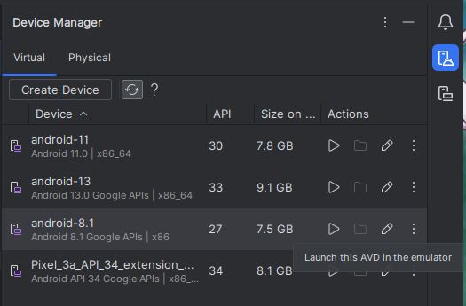
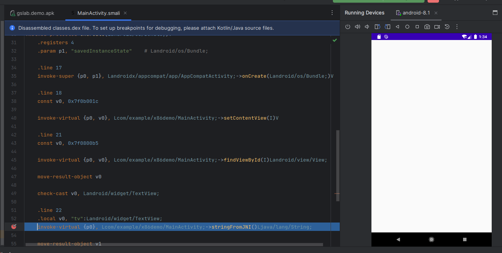

<h3>
移动端调试环境搭建
<h3>

---

> written by noxke

---

本篇将介绍安卓软件Java层和Native层调试工具的安装和简单使用

涉及到的软件如下

[Android studio](https://developer.android.google.cn/studio?hl=zh-cn)

[jadx](https://github.com/skylot/jadx)

[Ida Pro](https://hex-rays.com/IDA-pro/)

#### 软件安装

> jadx和Ida的安装使用都很简单，此处不做介绍，安装Android studio过程需要确保有正常的网络环境，网络配置不做介绍

1. 插件安装
   
   [Chinese (Simplified) Language Pack / 中文语言包 - IntelliJ IDEs Plugin | Marketplace](https://plugins.jetbrains.com/plugin/13710-chinese-simplified-language-pack----/versions#tabs)
   
   [GitHub - JesusFreke/smalidea: smalidea is a smali language plugin for IntelliJ IDEA](https://github.com/JesusFreke/smalidea)

2. SDK安装
   
   打开SDK Manager，修改sdk目录，安装如下SDK工具
   
   

3. 添加环境变量
   
   将`$sdkPath/platform-tools/`
   
   `$sdkPath//opt/android-studio-sdk/ndk/26.0.10792818/toolchains/llvm/prebuilt/linux-x86_64/bin/`添加到环境变量，ndk变量需要根据自己的环境情况进行添加

4. 创建Android Virtual Device(AVD)虚拟机
   
   打开Virtual Device Manager
   
   选择创建，按照个人习惯，机型选择`Pixel XL`，镜像选择`Oreo`(API27 x86 Android 8.1)，如果是64位环境，选择`Tiramisu`(API33 x86_64 Android 13.0)

   将Device Frame的勾取消，点击完成即可创建

#### Android Studio调试

选择右图`Profile or Debug APK`

有可能打开后和左图一样，没有`Profile or Debug APK`选项，如果出现该情况，进入到插件设置，启用Android APK Support和Android NDK Support并重启Android Studio

选择`Profile or Debug APK`后，选中需要调试的apk文件

左侧选择java并找到要调试的类，打开编译后的smali代码，对smali代码不了解的可以使用jadx工具对照查看反编译的java代码

> 虽然jadx也可以进行动态调试，但不推荐，很多情况下无法看到寄存器的值

选择调试的AVD虚拟机并编辑调试配置文件

将Debuger类型修改为Java Only，不修改的情况下会默认附加lldb调试器，导致ida调试器无法附加

在Device Manager中启动AVD虚拟机

下断点并点击调试

正常情况下程序会断下并进入调试状态，但有时会出现无法调试的情况，如果发生该情况，到插件管理禁用Android APK Support和Android NDK Support(可不进行重启)

剩下的调试部分不做介绍

#### Ida调试

确保上述操作AVD虚拟机启动和软件进入调试状态

提取程序的lib文件(使用unzip解压apk文件，在lib目录中找到对于处理器架构的so文件)

将Ida的dbgsrv目录下的对应架构的调试服务器上传到AVD虚拟机中，例如本题为`android_x86_server`，开启29346端口转发(开启转发失败时去掉-s选项)

adb shell进入到AVD虚拟机的命令行，su切换到root权限，进入dbgsrv目录

为`android_x86_server`添加可执行权限并运行

启动ida32并选择要调试的so文件(不建议修改文件名)

找到需要调试的函数下断点

选择调试器为`Remote Linux debugger`

Debugger->Process Option设置Hostname为`127.0.0.1`

Debugger->Attach to process选择要调试的进程

出现询问模块名相同选择`Same`

Ida附加后会自动断下，按F9运行一次

回到Android Studio单步执行native函数，Ida会在断点处断下

剩下的调试部分不做介绍
