### 静态分析

运行`crackme2.exe`文件，熟悉的检测到虚拟机弹窗

大概率vmp加壳，使用`exeinfo`工具验证

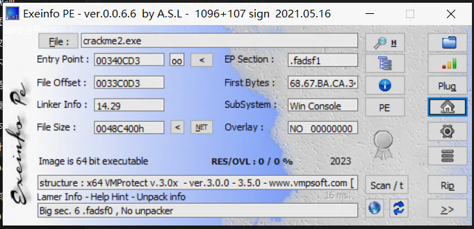

确认是vmp加壳，~~关闭环境，打开移动端题目分析~~

使用ida64打开程序确认加壳的部分

程序入口push call，典型的vmp特征，程序入口处加壳，无法静态定位到程序入口点，暂时不能确定是否对整个程序加壳，静态分析难度较大

### 动态调试分析

由于有vmp壳的存在，程序有虚拟机检测和调试器检测，使用ida绕过调试不方便，应此使用[x64dbg](https://github.com/x64dbg/x64dbg)进行调试分析

反调试屏蔽插件`ScyllaHide`设置如下

调试器运行程序，第一次会在程序入口点断下

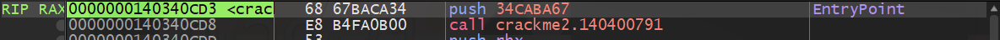

此处为vmp入口点，继续运行程序

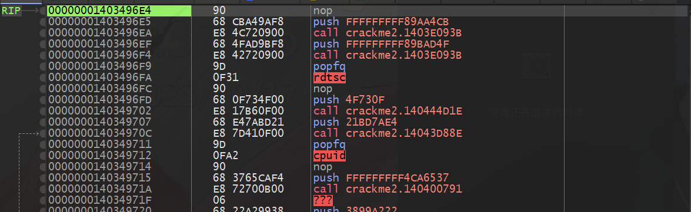

程序会在上图三处`nop`指令处断下，直接继续运行，如果反调试屏蔽正常，程序将进入运行状态

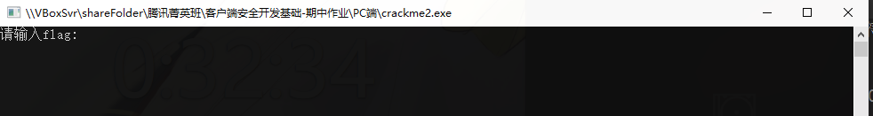

等待输入状态中，随意输入并回车后（两次回车），程序继续运行，几秒钟后程序关闭，和没有调试器运行时状态一致，因此已经绕过程序的反调试

由于不确定程序的逻辑部分是否加壳，通过API调用栈回溯的方式找到API调用代码

对可能的输入输出API下断点

- kernel32.ReadConsoleW

- kernel32.ReadFile

- kernel32.WriteConsoleW

- kernel32.WriteConsoleA

- kernel32.WriteFile

重新调试运行程序，跳过几个检测断点后，进程在`kernel32.WriteFile`断下，查看参数寄存器

rcx为文件句柄，rdx为输出缓冲区，r8为输出字节长度，其他参数此处忽略

输出字符串为`请输入flag:\r\n\r`，正好为程序的输出提示，因此可以确认程序的输入输出分别使用`ReadFile`和`WriteFile`实现，关闭其他断点

查看调用堆栈

堆栈调用过多，逐层返回分析

当进程返回到`0x140298DF8`地址处时，继续Ctrl+F9后程序在`ReadFile`断下，因此程序的输出逻辑应该在`0x140298DF8`附近

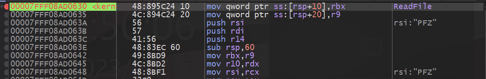

断下位置应该是程序的输入位置，与输出时的回溯相同，查看调用堆栈，逐层返回分析

返回到如下位置，与上述的输出提示字符串位置接近

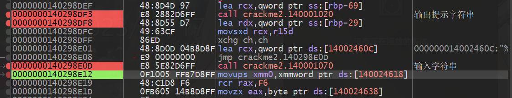

查看进程堆栈

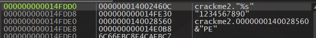

输入的字符串地址储存在堆栈中，还观察到有格式化字符串`"%s"`存在，因此猜测次数为格式化输入函数调用

因此可以确认`0x140298E12`为输出提示字符串位置，`0x140298E12`为输入字符串位置，此时能够确定程序的逻辑部分未被vmp加壳，可以继续后续的动态调试分析

回溯堆栈确定程序的入口点

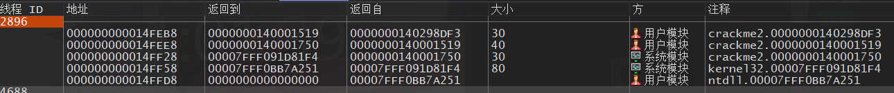

观察到用户层只有两层调用，因此当前层的上一层为程序的入口点位置

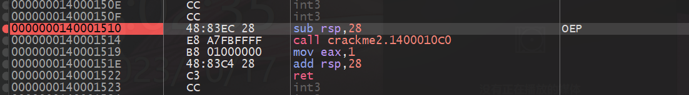

此时可确认程序的入口点OEP为`0x140001510`，下断点，主函数为`0x1400010C0`，输出提示字符串位置为`0x140298DF3`，输入字符传位置为`0x140298E0D`，对这几个地址下断点，重新调试运行程序，跳过检测断点后，进程在OEP断下

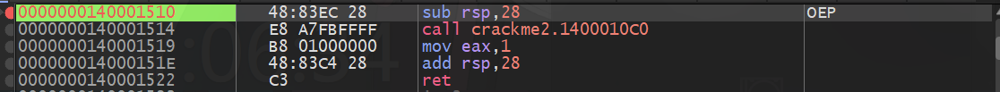

继续运行，程序在主函数入口点断下

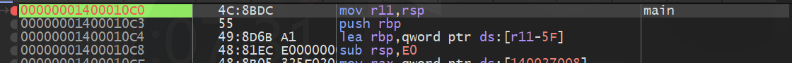

继续运行，程序在输处提示字符串处断下

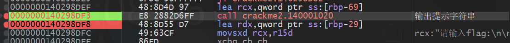

查看参数寄存器

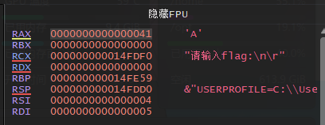

只有rcx一个参数，为`请输入flag:\n\r`，因此该处调用的函数为`puts`，后续程序输出时可能还会调用该函数，对函数内下断点

继续运行到输入字符串位置处断下

查看参数寄存器

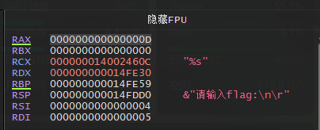

有两个参数，rcx为格式化字符串`"%s"`，rdx为地址`0x14FE30`，因此该处调用函数为`printf`，`0x14FE30`为输入缓冲区

继续运行到`printf`返回处，查看输入缓冲区`0x14FE30`处内存

此处内存为输入的字符串

上述操作完成了程序输入和输出的定位，接下来定位程序的校验部分以及结果输出部分

按`G`键切换到控制流视图

[cfg.png](./cfg.png)

其中的xmm寄存器操作部分可直接跳过，直接查看主函数结尾位置

一个分支跳转到程序结尾处，调用`sleep`等待5000ms显示结果，分支内调用`puts`函数，根据运行分析可知，当输入字符串时，程序不会输出反馈，输入几秒钟后程序停止，此逻辑正好对于该处代码，因此该代码块的上面应该为校验部分

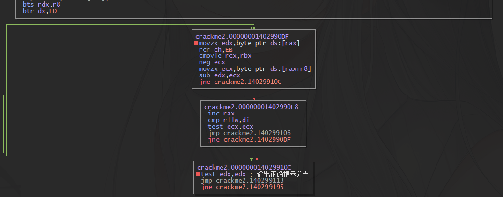

此处明显的串比较特征，从`[rax]`和`[rax+r8]`分别取出一个字节进行比较，结束比较的条件为两个字节不相等，或者`[rax+r8]`处取出的字节为0

对此处代码下断点，运行程序到该处断下，查看`rax`、`rax+r8`

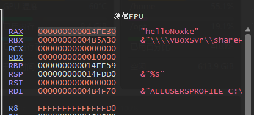

rax的值为`0x14FE30`，与`scanf`输入的字符串位置相同，字符串仍为输入字符串`helloNoxke`

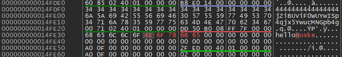

rax+r8的值为`0x14FE35`，内容为字符串`jZiBUViF0WUYwISp4qjx5YwucMNGpb4g`

因此该处比较输入字符串与`jZiBUViF0WUYwISp4qjx5YwucMNGpb4g`是否相等，程序flag为`jZiBUViF0WUYwISp4qjx5YwucMNGpb4g`

运行程序验证

得到正确的程序flag
