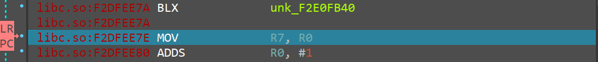
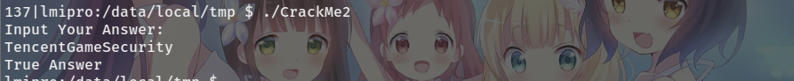
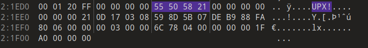

### DUMP脱壳

拿到附件先file一下


arm平台的ELF文件，因此运行和调试使用手机进行（不需要root）

ida32打开`CrackMe2`，进行静态分析


ida只识别出了几个函数，一眼壳，Shift+F12查看字符串，upx加壳


下载upx尝试使用`upx -d`脱壳


脱不下来，猜测upx特征被隐藏了，因此进行手动脱壳

先将`CrackMe2`push到手机，运行测试


程序在等待输入状态，此时upx已经完成解压缩，直接dump内存

启动idaserver，ida连接idaserver并附加调试


进程在read系统调用断下，根据LR寄存器定位返回地址，下断点，F9恢复进程运行


程序中随意输入字符串`1234567890`后回车，进程在断点出断下



使用Ctrl+F7运行到返回，直到PC离开libc.so内存空间，函数返回情况如下

```c
syscall_read -> __sread -> __srefill -> __srget -> getc -> debug005+0x9E64
```


PC离开libc.so内存空间后，返回到debug005段中，因此该段为upx解压之后的可执行段，使用OllyDump插件dump该段内存，选择debug005段


OllyDump自动识别了入口点`0x5358`，以及存在关联的段，所有参数保持默认，dump为`Crackme2_dump.so`

### 静态分析

使用ida32打开`Crackme2_dump.so`，自动识别出程序入口点`start`和主函数`main`


在main函数中，显然0x6E2C处为输出提示字符串，Shift+F12查看字符串，定位到如下可能有用的字符串

```c
LOAD:00048000 aCatProcNetTcpG DCB "cat /proc/net/tcp |grep :5D8A",0
LOAD:0004801E aR DCB "r",0
LOAD:00048020 aProcDStatus DCB "/proc/%d/status",0
LOAD:00048030 aTracerpid DCB "TracerPid",0
LOAD:0004803A aUndebug DCB "undebug",0xA,0
LOAD:00048050 aDmd2vxkydlvezu DCB "DMD2vxKYDLvezuriqND2DhP3BJfdtuWWrxe9pq==",0
LOAD:00048079 aWrongAnswer DCB "Wrong Answer",0xA,0
LOAD:00048090 aInputYourAnswe DCB "Input Your Answer:",0xA,0
LOAD:000480B0 aJustForKidding DCB "just for kidding",0
LOAD:00048120 aAbcdefghijklmn DCB "abcdefghijklmnopqrstuvwxyz",0
LOAD:00048140 aAbcdefghijklmn_0 DCB "ABCDEFGHIJKLMNOPQRSTUVWXYZ",0
LOAD:00048160 a0123456789 DCB "0123456789+/",0
LOAD:0004816D aTrueAnswer DCB "True Answer",0
LOAD:00048179 aWrongAnswer_0 DCB "Wrong Answer",0
```

##### 反调试

第一个可疑字符串`cat /proc/net/tcp |grep :5D8A`查看当前的TCP连接情况，`0x5D8A`转换为十进制为`23946`，idaserver的默认调试端口，因此此处为检查端口的反调试，查看交叉引用定位到反调试代码

定位到反调试函数的地址为`0x53F4`，命名为`undebug1`

第二个可疑字符串`/proc/%d/status`，查看进程的状态，根据后续的字符串`TracerPid`猜测该处是检查进程的`TracerPid`判断进程是否被调试，查看交叉引用定位到反调试代码


定位到反调试函数地址为`0x059D4`，命名为`undebug2`

第三个字符串`undebug`，是检测到调试器时的输出字符串，查看交叉定位输出该字符串的位置


定位到函数地址为`0x5AD0`，命名为`undebug`，该函数调用`undebug1`和`undebug2`检测是否被调试，由于`undebuge1`和`undebug2`中均没有使程序终止的代码，因此检查调试的入口点为`undebug`

##### 输入校验

注意到字符串`DMD2vxKYDLvezuriqND2DhP3BJfdtuWWrxe9pq==`，典型的base64字符串，尝试解码但发现乱码，猜测解码后的数据为二进制数据或base64码表被替换


`True Answer`应该是输入字符串正确时的输出，根据其交叉引用定位到输出该字符串的位置

定位到`0x7B50`函数处，将其命名位`check`


两个分支分别输出`Wrong Answer`和`True Answer`，查看该函数的反编译代码

```c
v6 = 0;
v52 = *(_DWORD *)off_47CE8;
*a1 = 0;
a1[1] = 0;
a1[2] = 0;
if ( a3 )
{
    LOBYTE(v41) = v46;
    LOBYTE(v7) = v45;
    do
    {
    v8 = *a2++;
    --a3;
    *(&v49 + v6++) = v8;
    if ( v6 == 3 )
    {
        v9 = v49;
        v10 = v51 & 0x3F;
        v11 = v50;
        v12 = (char *)dword_48230;
        v13 = (v51 >> 6) & 0xFFFFFFC3 | (4 * (v50 & 0xF));
        v47 = (v51 >> 6) & 0xC3 | (4 * (v50 & 0xF));
        v48 = v51 & 0x3F;
        if ( (byte_48228 & 1) == 0 )
        v12 = algn_48229;
        v43 = a3;
        v42 = a2;
        sub_8430(a1, (unsigned __int8)v12[v49 >> 2]);
        v14 = (char *)dword_48230;
        if ( (byte_48228 & 1) == 0 )
        v14 = algn_48229;
        v41 = (16 * v9) & 0x30 | (v11 >> 4);
        sub_8430(a1, (unsigned __int8)v14[v41]);
        v15 = (char *)dword_48230;
        if ( (byte_48228 & 1) == 0 )
        v15 = algn_48229;
        sub_8430(a1, (unsigned __int8)v15[v13]);
        v16 = (char *)dword_48230;
        if ( (byte_48228 & 1) == 0 )
        v16 = algn_48229;
        sub_8430(a1, (unsigned __int8)v16[v10]);
        v7 = v9 >> 2;
        a2 = v42;
        v6 = 0;
        a3 = v43;
    }
    }
    while ( a3 );
    v45 = v7;
    v46 = v41;
    if ( v6 )
    {
    if ( v6 <= 2 )
        memset(&v49 + v6, 0, 3 - v6);
    v45 = v49 >> 2;
    v46 = (16 * v49) & 0x30 | (v50 >> 4);
    v47 = (v51 >> 6) & 0xC3 | (4 * (v50 & 0xF));
    v48 = v51 & 0x3F;
    if ( v6 >= 0 )
    {
        v17 = (char *)dword_48230;
        if ( (byte_48228 & 1) == 0 )
        v17 = algn_48229;
        sub_8430(a1, (unsigned __int8)v17[v49 >> 2]);
        v18 = v6;
        v19 = &v46;
        do
        {
        v20 = (char *)dword_48230;
        v22 = (unsigned __int8)*v19++;
        v21 = v22;
        if ( (byte_48228 & 1) == 0 )
            v20 = algn_48229;
        sub_8430(a1, (unsigned __int8)v20[v21]);
        --v18;
        }
        while ( v18 );
    }
    if ( v6 <= 2 )
    {
        v23 = 3 - v6;
        do
        {
        sub_8430(a1, 61);
        --v23;
        }
        while ( v23 );
    }
    }
}
```

注意到该if内有明显的base64编码特征

每次从a2中取出三个字符，依次存放在v49, v50, v51中

```c
do
{
    v8 = *a2++;
    --a3;
    *(&v49 + v6++) = v8;
    if ( v6 == 3 )
    {
        /******/
        v6 = 0;
    }
}
while ( a3 );
```

对第一个字符取高6位作为索引查表，然后由`sub_8430`处理

```c
sub_8430(a1, (unsigned __int8)v12[v49 >> 2]);
```

对第一个字符取低两位，第二个字符取高4位，组合为6位，作为索引查表，然后由`sub_8430`处理

```c
v9 = v49;
v11 = v50;
v41 = (16 * v9) & 0x30 | (v11 >> 4);
sub_8430(a1, (unsigned __int8)v14[v41]);
```

对第二个字符取低4位，第三个字符取高两位，组合为6位，作为索引查表，然后由`sub_8430`处理 

```c
v13 = (v51 >> 6) & 0xFFFFFFC3 | (4 * (v50 & 0xF));
sub_8430(a1, (unsigned __int8)v15[v13]);
```

对第三个字符取低6位，作为索引查表，然后由`sub_8430`处理

```c
v10 = v51 & 0x3F;
sub_8430(a1, (unsigned __int8)v16[v10]);
```

后续不足3个字符的一次此处省略分析，分析发现存在两个关键点，一是base64编码的码表`(char *)dword_48230`，二是`sub_8430`函数

base64编码结束的地址为`0x7D84`

`0x48230`储存的是码表的地址，未在dump的文件中，后续动态调试时分析

`0x8430`处函数较为复杂，但是由于其输入简单，因此考虑在动态调试时分析

上述代码对参数字符串a2使用base64编码，分析`check`函数剩余代码

```c
v24 = *(unsigned __int8 *)a1;
v25 = a1[1];
v26 = *a4;
v27 = *((_DWORD *)a4 + 1);
if ( (v26 & 1 == 0 )
    v27 = v26 >> 1;
v28 = v24 & 1;
if ( (v24 & 1) == 0 )
    v25 = v24 >> 1;
```

在`check`函数开始时，`a1[0], a1[1], a1[2]`均被设为0，但a1作为`sub_8430`参数，多次参入base64编码的过程，且在最后的判断中，多个值从`a1`处读取，猜测`a1`处可能储存base64编码的结果

```c
if ( v27 )
{
    v32 = -(v26 >> 1);
    while ( *v31 == *v29 )
    {
    ++v32;
    ++v29;
    ++v31;
    if ( !v32 )
        goto LABEL_43;
    }
    goto LABEL_42;
}
```

上述代码进行字符串比较，关键判断

##### 动态调试分析

根据上述动态调试分析，获得以下需要断点的位置

- getc返回地址`debug005+0x9E64`
  
  > getc处为Thumb模式，需要使用Alt+g将Thumb标准设为1进行解析

- undebug反调试函数`debug005+0x5AD0`

- check函数`debug005+0x7B50`

- base64编码结束位置`debug005+0x7D84`

需要重点分析的内存区域有：

- check函数参数寄存器`R0`

- check函数参数寄存器`R3`

- base64编码码表`debug005+0x48230`

由于dump得到的elf文件中部分地址存储的值错误，不能之间进行运行调试，因此继续对`CrackMe2`进行附加调试

按照dump过程进行附加调试，进程断下后对上述地址下断点恢复运行，随意输入字符串`1234567890`

getc返回位置断下


取消断点，F9继续运行，undebug函数断下


手动将PC设到LR寄存器指向的返回地址处


F9继续运行


check函数断下，寄存器如下


记录R0寄存器的值`0xFFBAA758`

查看R1地址处（a2参数），很明显为输入的字符串


R2的值（a3参数）为`0xA`，很明显为输入字符串的长度

查看R3地址处(a4参数)，`0x21`


查看base64编码码表`debug005+0x48230`


注意到该码表与标准base64码表不同，标准base64大写字母在前，小写字母在后，而此处相反，因此经过编码后的字符串大小写与标准base64编码相反

```python
import base64
import string
 
str1 = "1234567890"

alpha_table = "\
ABCDEFGHIJKLMNOPQRSTUVWXYZ\
abcdefghijklmnopqrstuvwxyz\
0123456789+/"
alpha_table2 = "\
abcdefghijklmnopqrstuvwxyz\
ABCDEFGHIJKLMNOPQRSTUVWXYZ\
0123456789+/"
trans = str1.maketrans(alpha_table, alpha_table2)

str1_b64 = base64.b64encode(str1.encode()).decode()
str1_b64_2 = str1_b64.translate(trans)
print(str1_b64)
# MTIzNDU2Nzg5MA==
print(str1_b64_2)
# mtiZndu2nZG5ma==
```

F9运行到对输入字符串base64编码完成处`debug005+0x7D84`，查看之前记录的R0中地址处内容`0xFFBAA758`


第一个值为`0x21`，根据前面的分析，可能是待比较的数据长度，第二个值为`0x10`，可能为输入字符串编码后的长度，第三个值为地址`0xF67450A0`，查看该地址处内存


地址处的值为输入字符串编码后的b64字符串`mtiZndu2nZG5ma==`，与上述测试相同，该地址`-0x20`处为另一个b64字符串`vgvUy2vUDeDHBwvtzwn1CML0Eq==`，猜测为待比较的字符串，使用base64解码测试

```python
str2_b64 = "vgvUy2vUDeDHBwvtzwn1CML0Eq=="
str2_b64_2 = str2_b64.translate(trans)
str2 = base64.b64decode(str2_b64_2.encode()).decode()
print(str2)
# TencentGameSecurity
```

解码得到字符串`TencentGameSecurity`，猜测可能为flag

ida继续调试，运行到第一个判断分枝


此时R2为`0x1C`，`vgvUy2vUDeDHBwvtzwn1CML0Eq==`字符串的长度

R0为`0x10`，`mtiZndu2nZG5ma==`字符串的长度

当两个字符串长度不相等时，跳转到输出`Wrong Answer`，手动修改R0寄存器为`0x1C`，跳过该判断


运行到第二个分枝，仍然手动跳过


运行到循环进行比较的位置，比较R1和R3处字符串是否相等


查看寄存器发现R1指向字符串`mtiZndu2nZG5ma==`，但R3未指向另一字符串，猜测在手动跳转时可能导致寄存器改变错误

中断进程，对上述得到的疑似flag`TencentGameSecurity`进行测试



`Trun Answer`，说明确实是正确的flag

静态分析时得到一个使用base64解码乱码的字符串

```python
LOAD:00048050 aDmd2vxkydlvezu DCB "DMD2vxKYDLvezuriqND2DhP3BJfdtuWWrxe9pq==",0
```

猜测其编码码表被替换，对其重新解码

```python
str3_b64 = "DMD2vxKYDLvezuriqND2DhP3BJfdtuWWrxe9pq=="
str3_b64_2 = str3_b64.translate(trans)
str3 = base64.b64decode(str3_b64_2.encode()).decode()
print(str3)
# vgvUy2vUDeDHBwvtzwn1CML0Eq==
```

解码出来的字符串是`vgvUy2vUDeDHBwvtzwn1CML0Eq==`，再解码一次就是flag`TencentGameSecurity`

### upx -d脱壳

经过调试解压缩过程，发现该壳明显就是原版的upx,无法直接`upx -d`说明修改了，特征字段，编译一个测试文件进行加壳对照分析

使用010editor打开`CrackMe2`和对照文件，两个文件都为3个节区，理论上每个节区都存在`UPX!`关键字，搜索关键字`UPX!`


发现`CrackMe2`只搜索到3个`UPX!`关键字，而对照文件有4个，对照文件中4个`UPX!`第一个分布在文件开始位置不远处，第二个位于中间位置，后两个位于文件末尾，并且后两个距离很近，而`CrackMe2`末尾处只有两个`UPX!`关键字

定位到文件末尾




将`CrackMe2`对应位置处修改为`UPX!`


保存文件使用`upx -d`脱壳


脱壳成功，使用ida打开脱壳文件分析


程序的函数以及代码都能够正常分析，但是字符串未正常解析，无法快速定位，根据之前的分析可以知道字符串是在程序运行时解码生成的

尝试运行脱壳后的文件


能够正常运行，输入flag`TencentGameSecurity`后能够正确判断
